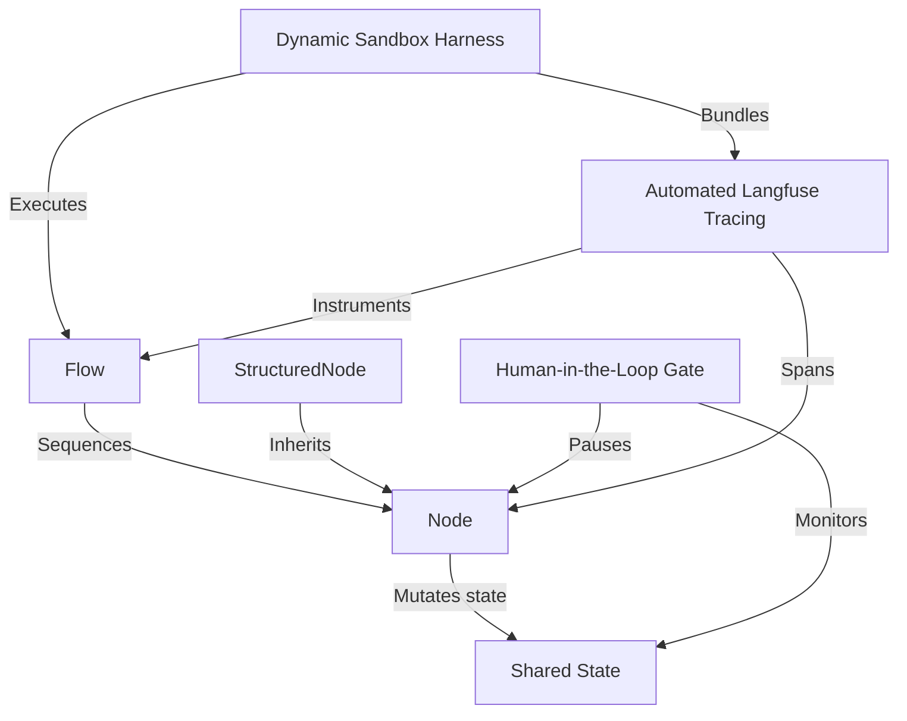

# Tutorial: pi-dynamic-workflow

The **pi-dynamic-workflow** project is a *zero-overhead, highly-isolated runtime sandbox* designed for dynamic engineering, execution, and tracing of powerful multi-step AI workflows. It implements **PocketFlow**'s clean structural primitives—*Shared State*, *Nodes*, and *Flows*—allowing developers and agents to construct complex linear pipelines and automated self-healing decision trees. Enhanced with **Pydantic-based structured schema coercion** and asynchronous *Human-in-the-Loop gates*, it manages unpredictable LLM behaviors safely. A TypeScript *Dynamic Sandbox Harness* automates runtime execution using `uv`, dynamically wrapping flows with *Automated Langfuse Tracing* while compiling *Mermaid topology blueprints* for complete project transparency and auditing.

**Source Repository:** https://github.com/mbenetti/pi-dynamic-workflow.git

<h2>Chapters</h2>

1. [Shared State](01_shared_state.md)
2. [Node](02_node.md)
3. [Flow](03_flow.md)
4. [StructuredNode](04_structurednode.md)
5. [Human-in-the-Loop Gate](05_human_in_the_loop_gate.md)
6. [Dynamic Sandbox Harness](06_dynamic_sandbox_harness.md)
7. [Automated Langfuse Tracing](07_automated_langfuse_tracing.md)

---
Generated by Pi Tutorial Builder Extension : https://github.com/mbenetti/pi-tutorial-builder.git