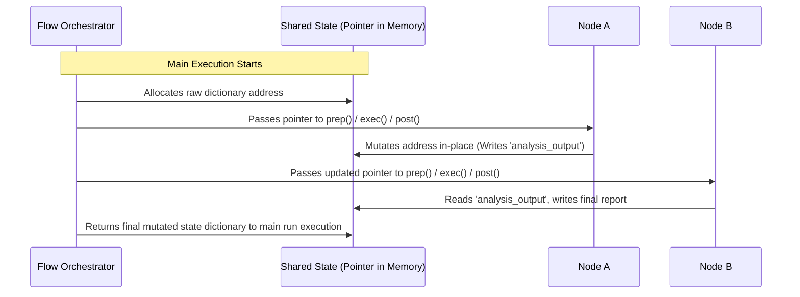

# Chapter 1: Shared State

Welcome to the development guide for `pi-dynamic-workflow` (known natively as PocketFlow). If you are building multi-step agentic pipelines, LLM-based reasoning chains, or dynamic state machines, you have likely run into the classic "spaghetti integration" problem. 

In this chapter, we will dissect the foundational layer of PocketFlow: **Shared State**. Understanding this concept is critical before we construct execution units ([Chapter 2: Node](02_node.md)) or orchestrate dynamic paths ([Chapter 3: Flow](03_flow.md)).

---

## The System Architecture Analogy: Shared Memory Bus

In computer architecture, early hardware systems attempted to connect every peripheral directly to every other peripheral. This point-to-point wiring quickly became a crossbar nightmare. Computer architects solved this by introducing the **System Bus**—a single, shared communication pathway that all components read from and write to.

```mermaid
graph TD
    subgraph Point-to-Point Messaging (Fragile Coupling)
        NodeA[Processor A] -->|Direct Pipe| NodeB[Processor B]
        NodeB -->|Direct Pipe| NodeC[Processor C]
        NodeA -->|Direct Pipe| NodeC
    end
    subgraph Common Bus Architecture (PocketFlow Shared State)
        Bus[(Shared State Dictionary)]
        CompA[Node A] <--> Bus
        CompB[Node B] <--> Bus
        CompC[Node C] <--> Bus
    end
```

In software design, tightly coupling worker functions by passing specific, fine-grained arguments outputted by one function directly into the parameters of the next leads to code fragility. If you modify the output structure of Step A, you break the input interface of Step B.

PocketFlow bypasses this issue using a **Shared State** design pattern, similar to a thread-safe shared address space, an operating system's shared memory segment, or a central **Redis** session storage system.

Instead of passing arguments downstream through nested, cascading return calls, every executor step (Node) reads from and writes to a central, in-memory Python dictionary that is passed sequentially through the pipeline.

---

## What is the Shared State?

In PocketFlow, the **Shared State** is a standard Python dictionary (`dict`) initialized at the entry point of your workspace and passed into the execution cycle of every node.

Compared to other orchestration engines, this presents distinct advantages:
* **Zero Serialization Overhead**: Unlike Apache Airflow (where `XCom` variables are serialized, stored in an external metadata database, and deserialized), PocketFlow passes Python objects directly by memory reference, resulting in sub-millisecond data transitions.
* **Continuous Auditing & State Tracing**: Because there is one single source of truth in memory, you can attach middleware tracer hooks (such as **Langfuse**) to snapshot the entire dictionary at each phase transition. This makes debugging complex LLM agent decisions straightforward.
* **Interface Decoupling**: Nodes do not need to know which node ran before them. They only need to know that their required keys exist inside the dictionary.

---

## Code Implementation: State Manipulation

Let us look at how the Shared State is initialized, read from, and mutated.

### Step 1: Initializing the Shared State
Before executing any workflow, you must define the schema of your shared dictionary.

```python
# Initialize session memory with raw inputs and storage keys
shared = {
    "raw_query": "Identify high-latency database queries.",
    "telemetry": {
        "execution_runs": 0,
        "anomalies_detected": 0
    }
}
```

This dictionary represents the starting state. It holds our input payload (`raw_query`) and pre-allocates nested schemas (`telemetry`) that subsequent steps will update.

### Step 2: Reading Input Parameters
When a node prepares to run, it pulls only the values it needs from the shared state. This boundary isolation happens during a node's `prep` phase.

```python
def prep(self, shared):
    # Retrieve query safely, providing a fallback option
    return shared.get("raw_query", "")
```

The node does not receive a massive argument list. It queries the shared reference for its target key, copying or passing the memory address of that specific string.

### Step 3: Mutating the Shared State
Once a node processes data (e.g., executing an LLM request or running a system utility), it commits its results back to the state dictionary during its `post` phase.

```python
def post(self, shared, prep_res, exec_res):
    # Mutate the shared memory space in-place
    shared["telemetry"]["anomalies_detected"] += 1
    shared["analysis_output"] = exec_res
    return "default"
```

Because Python dictionaries are passed by reference, modifying `shared` inside this method directly updates the orchestrator's master state.

---

## Memory Lifecycle Flow

The diagram below traces how a single dictionary pointer is evaluated by the system orchestrator across multiple nodes.



---

## Crucial Architectural Rule: Never Return the Shared State!

In PocketFlow, a Node's `post` phase has two responsibilities:
1. Mutate the `shared` dictionary in-place.
2. Return a **routing action string** (e.g., `"default"`, `"success"`, `"failure"`).

**Do NOT return the `shared` dictionary itself from the `post()` method!**

```python
# ❌ INCORRECT: Returning the dictionary will cause a routing crash!
def post(self, shared, prep_res, exec_res):
    shared["output_data"] = exec_res
    return shared

#  CORRECT: Update the state in-place, return an action string
def post(self, shared, prep_res, exec_res):
    shared["output_data"] = exec_res
    return "default"
```

**Why does returning the dictionary crash the run?**  
The Flow orchestrator uses the return value of `post()` to look up the next successor node in its state routing table. If you return the dictionary, the orchestrator tries to hash it. Because Python dictionaries are mutable and non-hashable, this immediately raises a `TypeError: unhashable type: 'dict'`.

---

## Industry Framework Comparisons

To help build immediate intuition around this architectural pattern, inspect how it compares with other industry standards:

| Framework / Tool | State Passing Mechanism | Data Isolation Strategy | Trade-offs |
| :--- | :--- | :--- | :--- |
| **Apache Airflow** | `XCom` variables | Serialized into DB, fetched on-demand by task ID. | High persistency; extreme performance bottleneck for large objects. |
| **LangGraph / States**| Redux-like State Reducers | State is copied and reduced at every transition. | Highly predictable; requires complex schemas and boilerplate code. |
| **PocketFlow** | **Shared Memory (`dict`)** | In-place mutations of a single memory pointer. | **Sub-millisecond execution**; requires discipline in handling keys. |

---

## Summary

The **Shared State** acts as the communication bus for your workflow, allowing developers to create highly decoupled, inspectable pipelines. By using a standard Python dictionary passed as a pointer throughout the run, steps remain isolated, testable, and freed from tight argument coupling.

Now that we understand how nodes share data, let's learn how to process this data. Proceed to **[Chapter 2: Node (Execution Unit)](02_node.md)** to explore how to construct robust, predictable execution units that read and update the Shared State.

---
Generated with Pi Tutorial Builder.