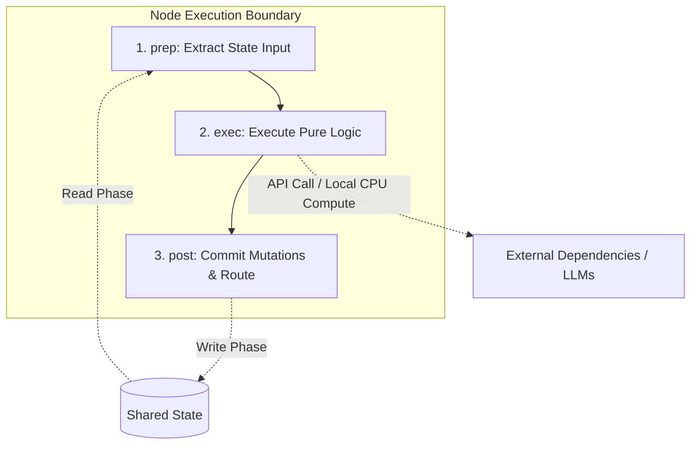
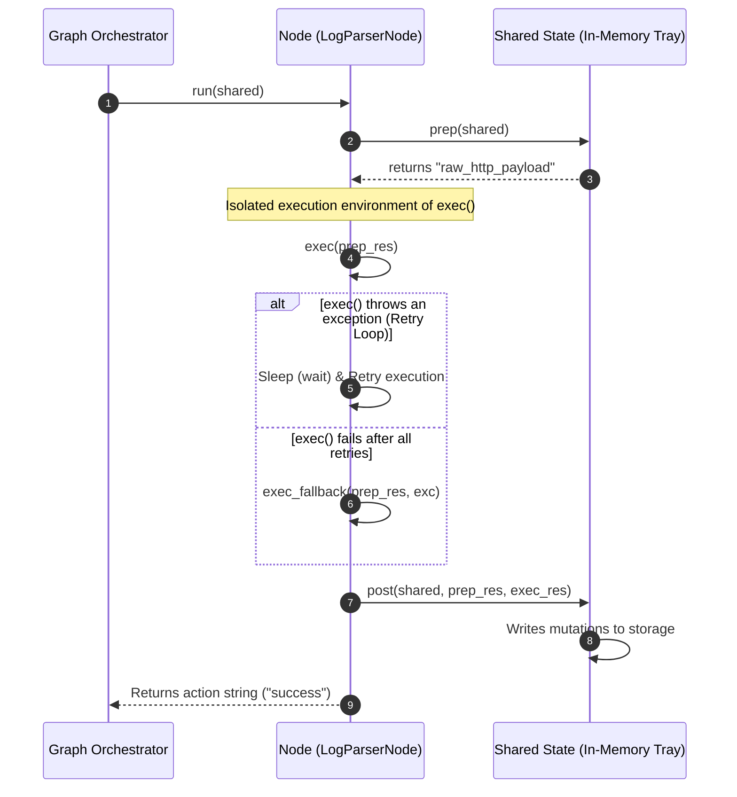

# Chapter 2: Node

In [Chapter 1: Shared State](01_shared_state.md), we analyzed how data moves between tasks under a single source of truth—behaving much like an in-memory data store, a shared memory segment in IPC, or a centralized Redis cache. However, a data store remains completely passive without execution engines to compute upon it.

To safely consume, process, and update state without introducing race conditions, dirty writes, or unrecoverable side-effects, we introduce the **Node**.

---

## The Instruction Pipeline Analogy

In hardware architecture, a modern CPU executes instructions via an instruction pipeline consisting of structured stages such as *Fetch, Decode, Execute, and Writeback*. Similarly, modern compiler engines (such as LLVM) split complex code optimization processes into distinct, isolated transformation passes.

PocketFlow's `Node` applies this exact pipeline design to your software orchestrations. Rather than writing monolithic functions that read, mutate, and evaluate state arbitrarily, a `Node` strictly enforces a segregated three-phase lifecycle:



By separating state access (`prep`) from core logical execution (`exec`) and state mutation (`post`), the framework guarantees:
*   **Idempotency & Safety**: Because `exec` has zero access to the mutable global state, failed computations can run repeatedly without causing partial or corrupt states.
*   **Decoupled Testability**: You can easily unit-test of your core business logic (`exec`) by mocking simple input arguments without instantiating complex state frameworks.
*   **Crash Isolation**: Exceptions raised during computation are securely caught before side effects are written back to memory.

---

## Step-by-Step Node Design

Let's dissect this architecture by building a component that extracts metrics from raw server logs. We begin by subclassing the base `Node` class.

```python
from pocketflow import Node

class LogParserNode(Node):
    def __init__(self):
        super().__init__(max_retries=3, wait=1)
```
*Design Explanation:* By calling our parent constructor with `max_retries=3`, we configure this node to recover from computational execution failures automatically, waiting 1 second between restarts.

### Phase 1: The `prep` Phase (Input Extraction)

The `prep` phase acts as our pipeline's *Fetch* stage. It accepts only the global `shared` state dictionary, preparing the target inputs required for downstream execution.

```python
# Inside LogParserNode
def prep(self, shared):
    # Retrieve dirty request payloads securely
    return shared.get("raw_http_payload", "")
```
*Design Explanation:* This method fetches exactly the slice of data it needs, keeping memory footprints light. It must never mutate anything in `shared`.

### Phase 2: The `exec` Phase (Pure Logic Execution)

The `exec` phase acts as our pipeline's *Execute* stage. It receives only the data returned from `prep` and executes pure algorithmic changes, network requests, or database calls.

```python
# Inside LogParserNode
def exec(self, prep_res):
    # Pure computational parsing step
    if not prep_res.startswith("POST"):
        raise ValueError("Non-POST requests unsupported")
    return prep_res.split(" ")[1] # Extract resource path
```
*Design Explanation:* Since `exec` does not know `shared` exists, its code remains completely isolated. If a remote API call or parser error fails here, we can safely invoke this function again with the same `prep_res` without risking corruption.

### Phase 3: The `post` Phase (Writeback & Signalling)

The `post` phase acts as the pipeline's *Writeback* stage. It accepts the mutable `shared` dictionary alongside our previous phases' inputs and outputs, saving mutations back to state.

```python
# Inside LogParserNode
def post(self, shared, prep_res, exec_res):
    # Commit changes cleanly
    shared["target_path"] = exec_res
    return "success"
```
*Design Explanation:* This is the *only* phase authorized to mutate the shared dictionary. Once state updates complete, it returns an action string (`"success"`).

### ⚠️ Pitfall Alert: Returning Action Strings
The `post` method must **always** return a string action key (such as `"success"`, `"failure"`, or `"default"`). Returning the `shared` dictionary itself will break successor routing, causing the engine to crash with a `TypeError: unhashable type: 'dict'`.

---

## Self-Healing and Error Boundaries

In standard task runners (such as Celery or Apache Airflow), running high-resiliency processes requires storing external database logs or complex state tracking. PocketFlow handles this within the node boundary.

If an exception occurs within `exec`, PocketFlow halts execution before state updates can run in `post`. The engine rewinds, pauses, and restarts the `exec` phase with our cached `prep` values. We can integrate dynamic fallbacks as well:

```python
# Inside LogParserNode
def exec_fallback(self, prep_res, exc):
    # Invoked only if all 3 retries throw errors
    print(f"Permanent parsing crash: {exc}")
    return "/error-fallback"
```
*Design Explanation:* Overriding `exec_fallback` provides a recovery circuit breaker, passing a safe default downstream to preserve workflow progress.

---

## The Execution Lifecycle

The sequence diagram below shows how the internal orchestrator manages values across safety boundaries during a typical pipeline run:



---

## Summary

By segregating raw tasks into clean `prep`, `exec`, and `post` pipeline stages, we have established atomic, testable, and self-healing nodes. However, individual nodes represent only isolated processing stages. To build complete systems, we must link them into conditional execution topologies.

In [Chapter 3: Flow](03_flow.md), we will stitch these atomic units together into complex execution graphs.

---
Generated with Pi Tutorial Builder.