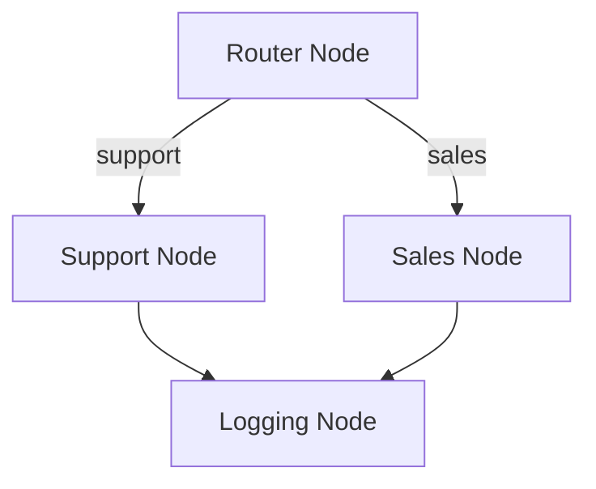
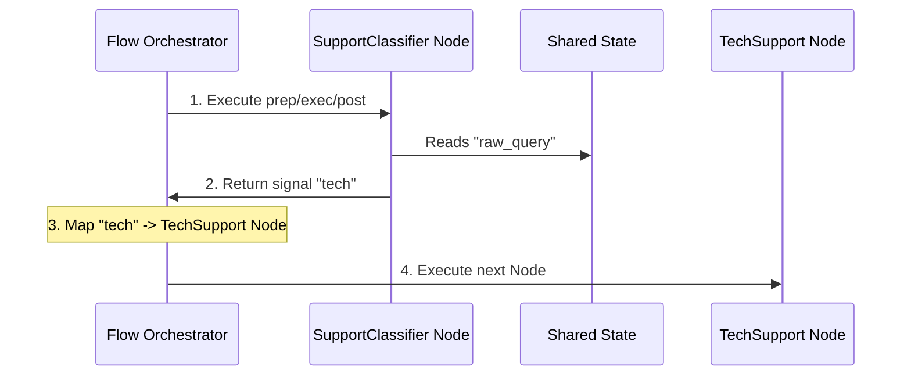

# Chapter 3: Flow

In [Chapter 1: Shared State](../01_shared_state.md), we analyzed the unified data bus that lets your pipeline communicate safely. In [Chapter 2: Node](../02_node.md), we built decoupled executing units (the workstations) that perform atomic operations. However, a set of disconnected nodes and a shared dictionary do not make a workflow. We need an orchestrator to manage the execution order and route data.

This chapter introduces the **Flow** and **AsyncFlow** abstractions. These orchestrators act as the network control plane for your workspace, allowing you to build sequential pipelines, complex branching topologies, loops, and nested subflows.

---

## The Network Switch Analogy

In network architecture, individual servers do not decide where to route packets. Instead, a **Network Switch** or **IP Router** maintains a routing table. The router reads incoming headers (action signals) and directs the payload to specific ports.



This model is similar to how orchestrators work in tools like **Apache Airflow** or **Celery**:
* **Nodes** act as isolated systems.
* **Flows** act as the routing table, defining connections and monitoring completion codes.

By separating execution (Node) from orchestration (Flow), your system stays modular. You can change your execution layout without editing your business logic.

---

## Core Routing Syntax

PocketFlow uses simplified Python operators to define routing tables.

### 1. Sequential Chaining (`>>`)
To run one node directly after another, use the shift-right operator:

```python
# Create sequences quickly
preprocess_node >> feature_extraction_node >> model_inference_node
```
The operator registers `feature_extraction_node` as the default successor to `preprocess_node`.

### 2. Conditional Branching (`- "signal" >>`)
For conditional routing, evaluate a string signal returned by the preceding node's `post` phase:

```python
# Route dynamically based on status output
validation_node - "valid" >> process_node
validation_node - "invalid" >> alert_node
```
The hyphen operator returns a conditional transition wrapper, mapping specific output string keys to your target nodes.

---

## Critical Rules of Flow Construction

To safely build workflows with `pi-dynamic-workflow` and avoid runtime execution errors, you must follow three architecture rules:

### I. Never Return the Shared State Dict
The `post` (or `post_async`) method of a Node must return an **action string key** (e.g., `"default"`, `"success"`, `"failure"`), not the `shared` dictionary.

Returning a dictionary causes internal routing issues:
```python
# WARNING: This pattern triggers a crash!
# TypeError: unhashable type: 'dict'
return shared 
```
Instead, modify `shared` in-place and return a string:
```python
shared["processed_data"] = final_output
return "success"
```

### II. Always Subclass Flow or AsyncFlow
Do not build dynamic networks using basic factory helpers. Always subclass `Flow` (for synchronous runs) or `AsyncFlow` (for asynchronous runs) directly:

```python
from pocketflow import Flow

class ProductionPipeline(Flow):
    # Defining within a class allows autowrapping
    pass
```
Subclassing allows visualizers and trace engines to find your workflow structure, wrap it with `@trace_flow()`, and build interactive canvas diagrams.

### III. Always Initialize with `start` (Never `start_node`)
When calling the parent class constructor inside your custom Class initialization, pass your first executing node using the `start` parameter:

```python
# CORRECT
super().__init__(start=first_node)
```
Using `start_node` will trigger a runtime error:
```python
# CRITICAL FAILURE
super().__init__(start_node=first_node)
# TypeError: Flow.__init__() got an unexpected keyword argument 'start_node'
```

---

## Step-by-Step Implementation

Let's build a branching flow that routes customer support tickets. 



### 1. Defining the Nodes
We begin by defining the classifier and worker nodes in `nodes.py`.

```python
from pocketflow import Node

class SupportClassifier(Node):
    def prep(self, shared):
        return shared.get("raw_query", "")
```
Here, we read the query from the shared dictionary.

```python
    def exec(self, query):
        if "password" in query or "error" in query:
            return "tech"
        return "billing"
```
The node processes the text and return a category classification string.

```python
    def post(self, shared, prep_res, exec_res):
        shared["category"] = exec_res
        return exec_res # Returns classification as transition signal
```
We save the classification to the state dictionary and return the signal to the flow supervisor.

Next, we define our destination handler worker nodes:

```python
class TechSupportNode(Node):
    def prep(self, shared):
        return shared.get("raw_query")

    def exec(self, query):
        return f"Routing priority tech ticket: {query}"

    def post(self, shared, prep_res, exec_res):
        shared["action_performed"] = exec_res
        return "default"
```
This node handles tech-related queries.

```python
class BillingNode(Node):
    def prep(self, shared):
        return shared.get("raw_query")

    def exec(self, query):
        return f"Routing standard billing ticket: {query}"

    def post(self, shared, prep_res, exec_res):
        shared["action_performed"] = exec_res
        return "default"
```
This node handles billing-related queries.

---

### 2. Creating the Flow
Now we connect these nodes inside a structured class in `flow.py`.

```python
from pocketflow import Flow
from nodes import SupportClassifier, TechSupportNode, BillingNode

class SupportRoutingFlow(Flow):
    def __init__(self):
        classifier = SupportClassifier()
        tech = TechSupportNode()
        billing = BillingNode()
```
We initialize the nodes.

```python
        # Configure routing based on action signals
        classifier - "tech" >> tech
        classifier - "billing" >> billing
        
        super().__init__(start=classifier)
```
We configure the routing rules and start the flow at the classifier node.

---

### 3. Execution Driver
Now we run the flow from our main entry point, `main.py`.

```python
from flow import SupportRoutingFlow

if __name__ == "__main__":
    flow = SupportRoutingFlow()
    shared_state = {"raw_query": "My application resets on password login"}
```
We initialize the flow and shared state.

```python
    flow.run(shared_state)
    print("Action Result:", shared_state["action_performed"])
```
We execute the flow and print the updated state.

Running this script prints:
```text
Action Result: Routing priority tech ticket: My application resets on password login
```

---

## Asynchronous Flow Orchestration

For concurrent processes, such as calling multiple APIs or parsing multiple files at the same time, subclass `AsyncFlow` and use async nodes.

```python
from pocketflow import AsyncFlow, AsyncNode
import asyncio
```
Import our asynchronous components.

```python
class AsyncFetchNode(AsyncNode):
    async def prep_async(self, shared):
        return shared["url"]

    async def exec_async(self, url):
        await asyncio.sleep(0.5) # Simulate non-blocking I/O fetch
        return f"HTML content from {url}"

    async def post_async(self, shared, prep_res, exec_res):
        shared["raw_html"] = exec_res
        return "default"
```
The node processes data asynchronously using non-blocking operations.

```python
class AsyncPipeline(AsyncFlow):
    def __init__(self):
        fetcher = AsyncFetchNode()
        super().__init__(start=fetcher)
```
We define an asynchronous flow.

```python
async def execute():
    shared = {"url": "https://example.com"}
    pipeline = AsyncPipeline()
    await pipeline.run_async(shared)
    print(shared["raw_html"])
```
Run using an asynchronous driver loop.

---

## Nesting Sub-Flows

Because `Flow` inherits from the base `Node` class, **flows are themselves nodes**. This enables composite nesting:

```python
class ComplexWorkflow(Flow):
    def __init__(self):
        ingest = IngestNode()
        router = SupportRoutingFlow() # Entire sub-flow used as a Node!
        archive = LogArchiveNode()
        
        ingest >> router >> archive
        super().__init__(start=ingest)
```

Nesting lets you build complex, multi-stage systems out of simpler, testable sub-workflows.

---

## Next Steps

Now that you know how to build and route dynamic flows, we can make our workflows more robust by enforcing strict data models.

Continue to **[Chapter 4: StructuredNode](../04_structurednode.md)** to learn how to enforce schema guarantees and structured JSON inputs and outputs for LLMs.

---
Generated with Pi Tutorial Builder.