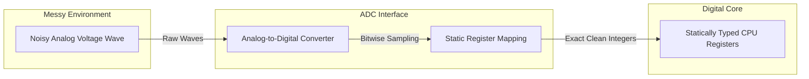
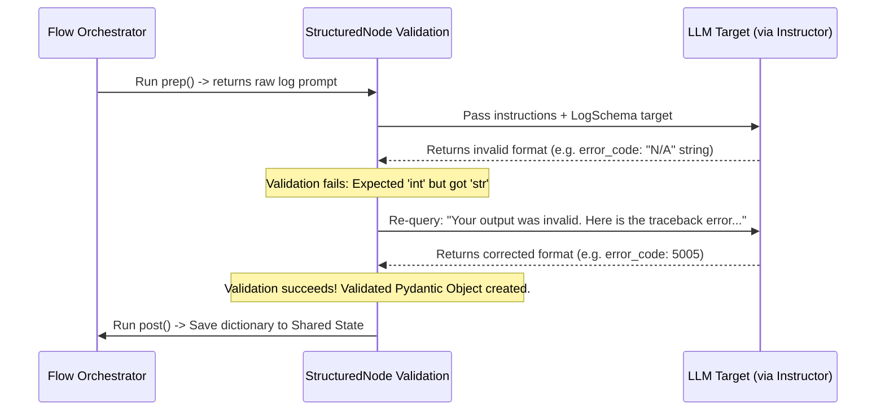

# Chapter 4: StructuredNode

In [Chapter 2: Node](02_node.md), we learned how to design isolated execution blocks, and in [Chapter 3: Flow](03_flow.md), we constructed orchestrations to route our execution path. However, when building production workflows powered by Large Language Models, we face a major engineering hurdle: **unstructured outputs are inherently unstable.**

If you ask an LLM to catalog system errors and verify if a server reboot is necessary, it might return a conversational block: *"Based on the diagnostics, yes, you should reboot. I rate this urgency as critical."* 

Parsing this raw, unpredictable text in downstream nodes using regular expressions or string splits is highly fragile. Any slight change in the LLM's conversational prefix will break your processing logic, causing database constraint violations or system crashes. 

To bridge the gap between unstructured natural language and deterministic code, PocketFlow introduces the **StructuredNode**.

---

## Technical Analogy: The Analog-to-Digital Converter (ADC)

In electrical engineering and embedded systems, microprocessors cannot directly parse raw, continuous, and noisy analog voltage waves. If you feed raw electromagnetic noise straight into a standard CPU register, the undefined voltages will cause logical corruption. 

To solve this, hardware designers route analog inputs through an **Analog-to-Digital Converter (ADC)**. The ADC samples the continuous, messy wave and casts it into an exact, statically structured digital bitstream (such as a 12-bit integer) that can be read safely by standard program registers.



In PocketFlow, a **StructuredNode** acts as your workflow's Analog-to-Digital Converter (ADC). It takes highly unpredictable, unstructured textual responses from an LLM and casts them into a statically typed, validated Python object (via Pydantic and the Instructor library). This guarantees that downstream execution units receive perfect data structures, completely free of conversational fluff.

---

## Architectural Schema and Code Implementation

The `StructuredNode` achieves this transformation by combining **Pydantic** (to act as the register mapping blueprint) and **Instructor** (to compel the model's token-generation weights to output valid JSON schemas).

Let's build a structured triage system for processing high-volume application logs.

### Step 1: Defining the Pydantic Schema Blueprint
First, we define our desired data schema. This class acts as the digital register interface that the LLM must populate.

```python
from pydantic import BaseModel, Field

class LogSchema(BaseModel):
    is_critical: bool = Field(description="True if server requires immediate intervention")
    error_code: int = Field(description="Database or network error code integer")
    categories: list[str] = Field(description="Tags describing the failure categories")
```
*What is happening here?*  
We define a Pydantic model (`LogSchema`) mapping clean, native types (`bool`, `int`, `list[str]`) with semantic descriptions. These schema descriptions are used to construct the LLM systemic JSON prompt behind the scenes.

### Step 2: Instantiating the StructuredNode Class
Next, we inherit from `StructuredNode` instead of the primitive `Node` to inject the validation layer.

```python
from pocketflow import StructuredNode
from utils.call_llm import get_instructor_client

class LogParserNode(StructuredNode):
    def __init__(self):
        super().__init__(
            response_model=LogSchema,
            client=get_instructor_client(),
            model="gpt-4o"
        )
```
*What is happening here?*  
We pass our `LogSchema` model and a patched Instructor client to the superclass constructor. This configures the node to intercept raw model output and pass it to the Pydantic validator before finishing the node's run cycle.

### Step 3: Preparing the Raw Payload in `prep`
We extract the messy, raw telemetry log from our [Shared State](01_shared_state.md).

```python
def prep(self, shared):
    # Retrieve messy unstructured log from the shared dict
    return f"Parse this system log raw traceback: {shared['raw_log']}"
```
*What is happening here?*  
The `prep` phase extracts the raw, conversational, or system strings from our shared memory and returns a prompt instruction.

### Step 4: Storing the Casted Object in `post`
Since the validation is handled internally by the framework, our `exec_res` argument arrives as an instantiated object of our Pydantic class.

```python
def post(self, shared, prep_res, exec_res):
    # exec_res is guaranteed to be a validated LogSchema object!
    shared["parsed_telemetry"] = exec_res.model_dump()
    return "default"
```
*What is happening here?*  
We dump the verified, structured keys directly back into the [Shared State](01_shared_state.md). If the model attempt fails validation, this step is skipped entirely, triggering the self-healing error flow.

### Step 5: Orchestrating and Running the Pipeline
Now, we construct a flow and execute it safely with confidence that downstream components won't encounter malformed fields.

```python
from pocketflow import Flow

shared_state = {"raw_log": "DB_CONN_TIMEOUT (Error 5005) - Connection dropped!"}
parsing_flow = Flow(start=LogParserNode())
parsing_flow.run(shared_state)
```
*What is happening here?*  
We instantiate our flow, pass our shared state memory space, and execute the run cycle. `shared_state["parsed_telemetry"]` is now guaranteed to have typed values: `{"is_critical": True, "error_code": 5005, "categories": ["Database", "Timeout"]}`.

---

## Self-Healing Validation Loops

A major design advantage of the `StructuredNode` is its **Self-Healing Loop**. In standard LLM implementations, if a model outputs a formatting bug, the software crashes with a `JSONDecodeError` or a valuation parsing exception.

In PocketFlow, if the model returns JSON that fails Pydantic validation (for example, putting `"N/A"` into our `error_code` integer field), the `StructuredNode` catches the exception. Instead of collapsing, it bundles the traceback error logs and feeds them back to the LLM as part of a localized, automated retry step.



This cycle continues dynamically up to your configured `max_retries` value before throwing a final exception or activating your registered fallback behaviors.

---

## System Design and Framework Comparisons

Understanding how this schema enforcement mechanism differs from other paradigms helps when choosing runtime libraries for complex multi-agent setups.

| Validation Paradigm | Implementation Strategy | Native Failure Recovery | Processing Overhead |
| :--- | :--- | :--- | :--- |
| **Traditional String Prompting** | Regex parsing on raw chat outputs (e.g., XML parsing wrappers). | **None**. Crashes if the model changes formatting or includes chat conversational wrapper logs. | Very low, but fragile. |
| **JSON Mode (API-level)** | API structures require system-level output constraints. | **Poor**. Ensures valid JSON syntax but does not enforce exact internal value types (e.g., string vs. float). | Minimal. |
| **PocketFlow StructuredNode** | **Instructor + Pydantic serialization layer**. | **High (Automated self-healing retries)**. Captures validation tracebacks and feeds them back to the LLM to self-heal. | Low (Sub-millisecond validation runtime). |

---

## Summary

The **StructuredNode** enforces rigid typing boundaries over unpredictable conversational LLM interfaces. By using Pydantic schemas as custom digital compiler molds, and executing automated self-healing validation loops on failure, you can safely connect unstructured linguistic AI outputs straight to mission-critical, typed backend architectures.

Now that we can guarantee raw inputs are securely cast into system-safe schemas, we can look at scenarios where our workflows need to stop and wait for executive human commands. Let's move on to **[Chapter 5: Human-in-the-Loop Gate](05_human_in_the_loop_gate.md)**.

---
Generated with Pi Tutorial Builder.