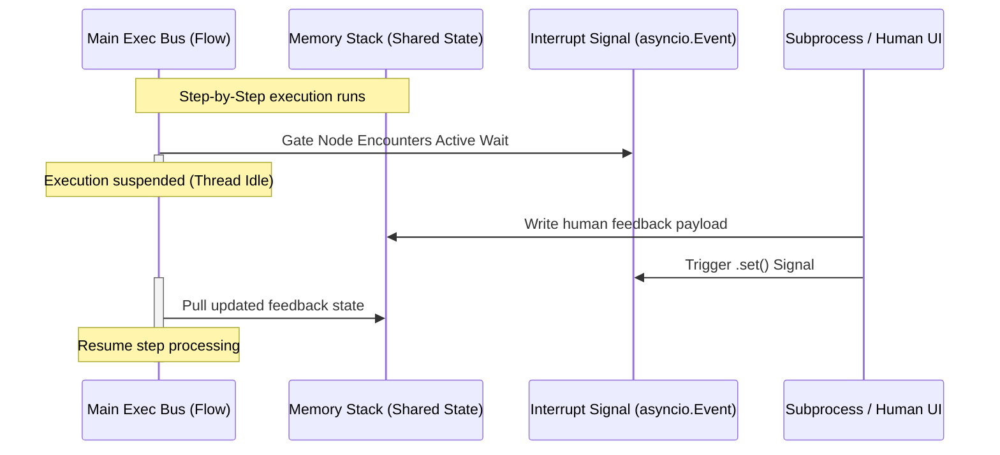

# Chapter 5: Human-in-the-Loop Gate

In [Chapter 3: Flow](03_flow.md), we established how to orchestrate automated nodes into branching execution Topologies. In [Chapter 4: StructuredNode](04_structurednode.md), we learned how to enforce absolute output schemas using Pydantic. However, even with rigorous schema guarantees, fully automated LLM execution chains can sometimes drift, necessitating human supervision before mutating mission-critical production systems. 

This chapter introduces the **Human-in-the-Loop (HITL) Gate**. This architectural design pattern intercepts automated background execution, yields control to external validation interfaces, and resumes processing only once a manual human signal is declared.

---

## Technical Analogy: OS Interrupt Handlers & CI/CD Manual Promotion Gates

In computer systems architecture, CPU execution is not always linear. When hardware components require immediate attention, they trigger an **Interrupt Request (IRQ)** line. The CPU immediately suspends its current execution registry state, jumps to an **Interrupt Service Routine (ISR)**, and resumes the paused computations only after the interrupt flag is cleared.



Similarly, in modern deployment pipelines (such as GitHub Actions or GitLab CI), progress halts before entering a `"production"` environment. The orchestrator triggers an **Environment Gate**, suspending the job runner thread until a project maintainer clicks "Approve". 

In PocketFlow, an **HITL Gate** functions exactly like an OS interrupt or a CI/CD promotion check. Rather than wasting raw CPU cycles on spinning/polling loops, the engine uses asynchronous semaphores and blocking event queries to safely freeze workflow processes.

---

## Architectural Comparison: Pause-and-Resume

To build immediate intuition around how PocketFlow handles human validation compared to historical and contemporary alternatives, consult this system matrix:

| Engine | State Suspend Strategy | Thread Resource Consumption | Overhead |
| :--- | :--- | :--- | :--- |
| **Apache Airflow** | Saves state to DB, kills task process, restarts container on reschedule. | Zero idle memory; high CPU container spin-up overhead. | Heavy (Seconds to Minutes) |
| **LangGraph** | Microstep persistence using persistent database checkpoints. | Low; requires external state synchronization. | Medium (Milliseconds to Seconds) |
| **PocketFlow** | **In-memory Suspend (`asyncio.Event` / CLI Wait)** | Zero CPU footprint (event loop parks the active task). | Sub-Millisecond (Instantaneous) |

---

## Concrete Concept Setup: The Local CLI Gate

We will build an iterative content-refinement loop. It generates a draft, presents it to a developer via a terminal, collects feedback, and either terminates on approval or recalculates a new draft based on human critique.

### Step 1: Draft Generator Node
First, we build the workspace's generator node, which reads feedback written to the [Shared State](01_shared_state.md).

```python
class DraftGen(Node):
    def prep(self, shared):
        return shared.get("feedback", "")
    def exec(self, feedback):
        # Generates a revision if feedback exists
        return f"v2 (Fix: {feedback})" if feedback else "v1 Draft"
    def post(self, shared, prep_res, exec_res):
        shared["draft"] = exec_res
        return "default"
```
The node pulls existing `feedback` from the shared dictionary, produces an updated draft version, and updates the shared memory index.

### Step 2: The CLI Interrupt Gate
Next, we build a node that acts as our interrupt handler, blocking execution using standard input.

```python
class CliGate(Node):
    def exec(self, prep_res):
        print(f"Review: {prep_res}")
        return input("Approve? (y/n): ")
    def post(self, shared, prep_res, ev_res):
        if ev_res.lower().strip() == "y":
            return "approve"
        shared["feedback"] = input("Provide rewrite feedback: ")
        return "reject"
```
During the `exec` phase, the execution process halts to accept terminal input. In `post`, returning `"reject"` sends execution backwards, saving the human commentary to the state.

### Step 3: Compiling the Refinement Flow
We subclass `Flow` to bind our looping graph topology securely.

```python
class HitlFlow(Flow):
    def __init__(self):
        gen, gate = DraftGen(), CliGate()
        gen >> gate
        gate - "reject" >> gen
        super().__init__(start=gen)
```
Using the conditional branching operator (`- "reject" >>`), we direct rejected states back to the generator. On `"approve"`, execution completes normally.

### Step 4: Driver Execution
Now, run the interactive workflow inside a system execution file.

```python
if __name__ == "__main__":
    state = {"draft": ""}
    HitlFlow().run(state)
    print("Final State:", state["draft"])
```
Running this file halts your terminal at step 2. Entering `n` routes flow execution backwards to execute a corrected iteration before exiting.

---

## Advanced Systems: Interprocess Async Gates (FastAPI / Web)

While a CLI `input()` blocking call is effective for single-user scripts, web servers and background queue systems must manage interrupts asynchronously. 

In asynchronous multi-user applications (such as FastAPI backends or WebSockets panels), we implement `AsyncNode` and utilize Python's native thread-safe `asyncio.Event` to pause a network task without freezing the server's primary event loop.

```python
class AsyncWebGate(AsyncNode):
    async def prep_async(self, shared):
        return shared["event"]
    async def exec_async(self, event):
        await event.wait() # Suspend active coroutine
    async def post_async(self, shared, prep_res, exec_res):
        return shared.get("action", "reject")
```
When a request hits `exec_async`, the node await-yields its execution thread back to the global event loop. The system consumes zero CPU while waiting for a signal.

### The FastAPI Integration Handler
To resolve these suspended node states from an external web interface, the REST application writes the feedback back to memory and raises the event flag:

```python
@app.post("/feedback/{task_id}")
async def post_feedback(task_id: str, action: str):
    task = tasks[task_id]
    task["shared"]["action"] = action
    task["shared"]["event"].set() # Unblock Node instantly
    return {"status": "unblocked"}
```
Calling `/feedback` executes `.set()`. This forces the paused event loop task to wake up, re-evaluate its state keys, and route cleanly to successor nodes.

---

## Next Steps

By leveraging the **Human-in-the-Loop Gate**, you prevent generative model failures from impacting production systems, marrying rapid automation with safety checks.

Now that we can construct nodes, build flows, and insert interactive human gates, we need a way to run and test these workflows locally. 

Proceed to **[Chapter 6: Dynamic Sandbox Harness](06_dynamic_sandbox_harness.md)** to explore how to test your flows inside isolated, high-performance sandbox environments.

---
Generated with Pi Tutorial Builder.