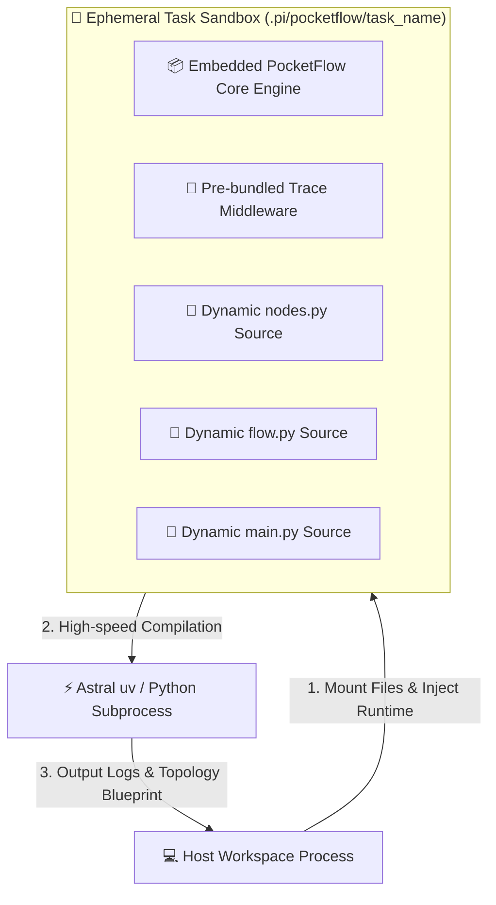
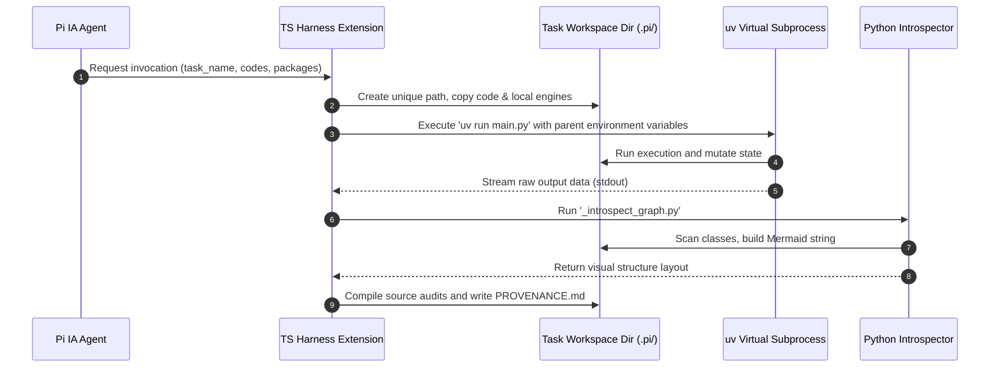

# Chapter 6: Dynamic Sandbox Harness

In [Chapter 5: Human-in-the-Loop Gate](05_human_in_the_loop_gate.md), we built a structured gateway to pause executing graphs, collect human feedback, and resume safely. However, as an AI agent dynamically generates code, compiles execution plans, and installs varying packages on the fly, a critical architectural challenge emerges: *Where can these dynamic Python runtimes execute safely without bricking the developer's system environment?*

If we directly run AI-generated scripts in our operating system's global namespace, we risk dependency pollution, corrupt configuration files, or executing destructive shell escapes. 

We solve this using the **Dynamic Sandbox Harness**—a TypeScript-powered Pi workspace controller that manages ephemeral environment provisioning, dynamic package isolation, and automated architectural provenance harvesting.

---

## The System Analogy: Ephemeral Chroot Jails & Compiler Backends

In system engineering, executing untrusted, highly dynamic code calls for the strict isolation of system assets. Operating systems achieve this safety partition using technologies like **chroot jails**, Linux **namespaces (cgroups)**, or transient micro-virtual machines (such as **AWS Firecracker**). 

The Dynamic Sandbox Harness behaves exactly like an **ephemeral chroot toolchain**. 

Instead of configuring permanent, heavy container networks, the harness behaves like an on-the-fly compiler backend:



Rather than burdening the system with static, heavyweight Docker containers, the harness configures a virtual sandbox area inside your local `.pi/pocketflow/` directory, compiles a completely local copy of the `pocketflow` framework inline, runs the isolated process via a fast execution toolchain, and pulls down clean results alongside a structural diagram.

---

## Core Sandboxing Architecture

To maintain high speed and prevent environment drift, the harness performs four sequential processes:

1. **Workspace Boundary Mapping**: Isolates directories by creating target-safe workspace directories for each execution slug.
2. **Framework Payload Injection**: Embeds the absolute core of the PocketFlow framework and metadata tracing middleware directly within the local workspace directory automatically.
3. **Transient Toolchain Virtualization**: Leverages high-speed local package systems (Astra's `uv`) to generate zero-config, isolated package trees out of host scope.
4. **Graph Introspection**: Scans the compiled runtime memory of the finished workflow to output a clean structural map inside the workspace.

---

## Sandboxed Runtime Mechanics

Let us look at how the TypeScript harness sets up directories, manages runtimes, and compiles executing topologies.

### Section 1: Creating Ephemeral Workspace Targets
The harness dynamically segments every workspace task inside a localized directory pathway to keep file output states separate.

```typescript
const taskDir = resolve(ctx.cwd, `.pi/pocketflow/${params.task_name}`);
await fs.mkdir(taskDir, { recursive: true });
await fs.mkdir(resolve(taskDir, "utils"), { recursive: true });
```
*Design Explanation:* Using filesystem utility calls, this script resolves a unique workspace subdirectory based on the AI's chosen `task_name`, isolating all subsequent code artifacts.

### Section 2: Injecting the Base Class Engine Payload
To remove external import dependencies, the harness dynamically writes the core of PocketFlow directly into the isolated sandbox folder.

```python
# Written directly into taskDir/pocketflow/__init__.py
class BaseNode:
    def __init__(self):
        self.params, self.successors = {}, {}
    def next(self, node, action="default"):
        self.successors[action] = node
        return node
```
*Design Explanation:* Since this script lives directly inside the task directory, any generated worker node can import `pocketflow` with zero latency, complete local independence, and no internet dependencies.

### Section 3: High-Speed Isolated Environment Launching
Instead of waiting for slow global configuration calls of standard pip environments, the harness uses `uv` to instantiate rapid, isolated environments.

```typescript
const withFlags = allRequirements.map(req => `--with "${req}"`).join(" ");
const execCmd = `"${uvPath}" run --no-cache ${withFlags} main.py`;
const { stdout } = await execAsync(execCmd, { cwd: taskDir, env: customEnv });
```
*Design Explanation:* This launches `uv run` to create a virtual environment, loading only the necessary packages (like `pydantic` or `instructor`) on-the-fly and discarding them when done.

### Section 4: Compiling Visual Topology Schematics
Once the Python runner finishes, the harness runs a virtual inspector that queries our node classes to map our workflow connections.

```python
import inspect, flow
flow_classes = [obj for name, obj in inspect.getmembers(flow, inspect.isclass) 
                if issubclass(obj, flow.Flow) and obj != flow.Flow]
flow_instance = flow_classes[0]()
print(build_mermaid(flow_instance))
```
*Design Explanation:* Using Python's runtime inspection module (`inspect`), this script finds matching `Flow` subclasses and auto-generates a clear text-based representation of the execution path.

---

## Environment Pipeline Dataflow

The sequence diagram below displays how the TypeScript controller orchestrates the local filesystem, environment managers, and introspection metrics:



---

## Industry Framework Comparisons

To contextualize this sandboxed compiler design, compare it to common industry task-isolation patterns:

| Isolation Strategy | Operational Architecture | Startup Overhead | Ideal Use Case |
| :--- | :--- | :--- | :--- |
| **Micro-Containerization** (Docker / Podman) | Full system image packaging under shared kernel namespaces. | High (typically 1–10 seconds per runtime check). | Heavy multi-tenant clouds or production deployments. |
| **Nix-Shell / Nix Flakes** | Declarative package isolation down to exact hardware hash footprints. | Medium (slow cold starts; instataneous warm caches). | Highly reproducible developer environments. |
| **Dynamic Sandbox Harness** | **Ephemeral path segment + Embedded Micro-Engine + uv** | **Sub-50ms** (near-instant execution). | **Agetinc on-the-fly execution and interactive code tests.** |

---

## Workspace Provenance Recording

A key benefit of this process is that every sandbox execution records a standard markdown file named `PROVENANCE.md` (and a matching `<task_name>_blueprint.md` in your main workspace folder).

This markdown file includes:
* **Prompt context**: The original prompt that requested the run.
* **Thought log**: The AI's architectural steps and considerations.
* **Topological maps**: Live-rendered Mermaid graph structures showing your node transitions.
* **Auditing source blocks**: Full copies of the generated `nodes.py`, `flow.py`, and `main.py` files.

This ensures you have complete visibility and audit logs inside your local repository, making debugging complex pipelines incredibly easy.

---

## Next Steps

By isolating our active workflows, dynamic library versions, and execution environments inside the **Dynamic Sandbox Harness**, we ensure our system remains safe, repeatable, and fast.

Now that we can safely launch sandboxed applications, how do we monitor their performance, understand underlying LLM API costs, and debug deep inside our logic states?

Proceed to **[Chapter 7: Automated Langfuse Tracing](07_automated_langfuse_tracing.md)** to see how we get production-grade telemetry for our AI systems.

---
Generated with Pi Tutorial Builder.