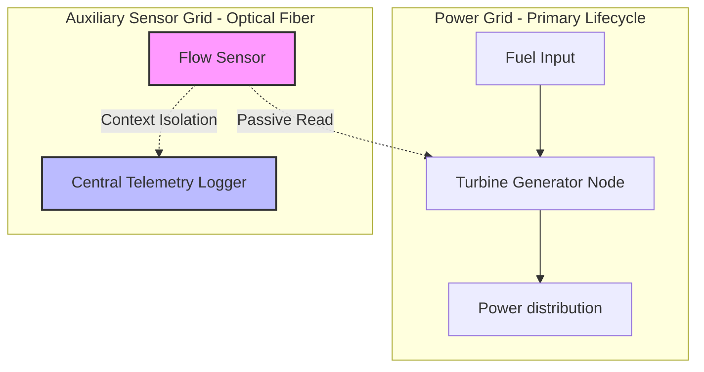
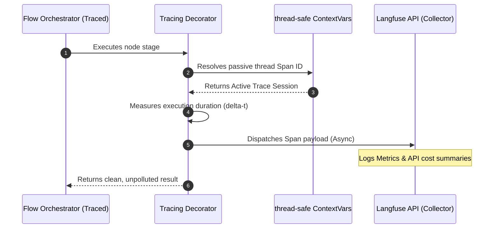

# Chapter 7: Automated Langfuse Tracing

In [Chapter 6: Dynamic Sandbox Harness](06_dynamic_sandbox_harness.md), we established an isolated local testing sandbox capable of executing complex PocketFlow graphs on-the-fly and outputting diagnostic Mermaid blueprints. However, running workflows in a production environment introduces a new challenge: debugging live, non-deterministic LLM pipelines without generating performance bottlenecks or cluttering clean execution code.

This chapter introduces **Automated Langfuse Tracing**. We will explore how PocketFlow utilizes thread-safe tracking mechanisms to log step execution times, inputs, outputs, exceptions, and token costs. This telemetric layer operates on a fail-safe framework, ensuring that a trace service failure never impacts your primary application lifecycle.

---

## Technical Analogy: Decoupled Auxiliary Sensor Grids

In industrial power stations, critical machinery is monitored by an **Auxiliary Sensor Grid**. These sensor nodes operate on isolated dedicated wireways, capturing temperature, load, and performance data at exact timestamps. 



This structural isolation ensures:
1. **Zero Interference**: If a passive sensor suffers an electrical short or runs out of power, the primary turbine continues to spin and distribute energy unaffected.
2. **Side-Channel Propagation**: State metadata is transmitted over separate channel lines, avoiding pollution of the primary fuel input.

In software engineering, traditional logging patterns often violate this isolation by forcing developers to manually pass tracking IDs (such as OpenTelemetry trace headers or Jaeger transaction keys) through every business logic function. 

PocketFlow resolves this using Python's native `contextvars` module. It acts as an optical fiber data path, quietly capturing telemetry behind your node boundaries without altering your core state interfaces. This design brings production-grade observability analogous to dedicated traces in enterprise engines like **Apache Airflow** or **Celery**, but with sub-millisecond execution overhead.

---

## The Trace Context Tracking Pattern

To track current execution context across asynchronous tasks or parallel threads without polluting the [Shared State](01_shared_state.md), we instantiate context-local tracing registries.

Let us inspect how thread-safe, isolated contexts are declared:

```python
import contextvars
# Define an isolated context storage variable
trace_ctx = contextvars.ContextVar("trace_ctx")
```
This single line declares our thread-safe tracking channel. Unlike global variables, which are shared across all executing contexts and subject to dirty reads, a `ContextVar` guarantees that each concurrent flow run maintains its own distinct tracing identifier.

Next, we bind our execution thread to a specific trace identifier within a local runtime scope:

```python
# Binds a trace ID to the current local thread
token = trace_ctx.set("flow_run_99fce97a")
```
When this line runs, the runtime allocates a thread-safe slot for the trace ID. Any downstream function or nested node can now read this value without passing it explicitly as an argument.

When the execution concludes, we clear the tracking token to restore the pristine local state:

```python
# Clean up state tracker after execution concludes
trace_ctx.reset(token)
```
Resetting the token prevents memory leakage and keeps context clean for subsequent runs.

---

## Automatic Flow Instrumenting

Rather than manually wrapping every `prep`, `exec`, and `post` method inside your [Node](02_node.md) classes, PocketFlow provides a unified class decorator: `@trace_flow()`.

Let us look at how easily we can activate auditing on our custom flows:

```python
from tracing import trace_flow
@trace_flow()
class TranslationFlow(Flow):
    def __init__(self, start):
        super().__init__(start=start)
```
Applying `@trace_flow()` auto-patches all connected nodes during instantiation, setting up spans for every phase execution.

---

## Graceful Degradation: The Silent No-Op Layer

A common failure mode in cloud-instrumented applications occurs when trace servers go offline, raising connection timeouts that crash the host application. pocket-flow prevents this by enforcing a silent **No-Op (No-Operation) fallback**.

Let us observe this safety validation check:

```python
import os
# Safely verify presence of vital access credentials
has_keys = bool(os.getenv("LANGFUSE_PUBLIC_KEY"))
```
If keys are missing, the tracing engine disables all outward-bound network calls immediately.

When keys are absent, the decorator substitutes a lightweight stub helper:

```python
def no_op_decorator(func):
    # Returns the original, unaltered execution logic
    return func
```
Because the decorator returns the raw, unmodified python logic when keys are missing, your pipeline runs with zero performance overhead in offline environments.

---

## The Telemetry Lifecycle Flow

The following sequence diagram maps how a traced node execution passes through the context layer and ships metrics to Langfuse:



---

## Comparison: observability Architectures

To build immediate intuition around how PocketFlow compares with alternative tracing paradigms:

| Metric / Feature | OpenTelemetry (Manual) | LangGraph / Langsmith | PocketFlow + Langfuse |
| :--- | :--- | :--- | :--- |
| **Context Propagation** | Manual carrier-injection boilerplate. | Implicit framework state wrapping. | **Automatic via thread-safe `contextvars`** |
| **Crash Protection** | Dependent on custom try/except safety wrappers. | Handled inside the platform boundary. | **Decoupled; silent fail-safe no-op mode** |
| **Execution Overhead** | High serialization cost. | Medium platform telemetry latency. | **Sub-millisecond (Zero when offline)** |

---

## Summary

By leveraging thread-safe `contextvars` and class-level decoration, PocketFlow's tracing module delivers production-grade observability without code clutter or run-time vulnerabilities. Your business logic remains clean and fast, while developers gain the debugging transparency of a central tracing dashboard.

This completes our deep-dive architecture series! You now have all the tools needed to design, execute, scale, and trace high-performance, self-healing, data-driven pipelines. Happy architecting!

---
Generated with Pi Tutorial Builder.