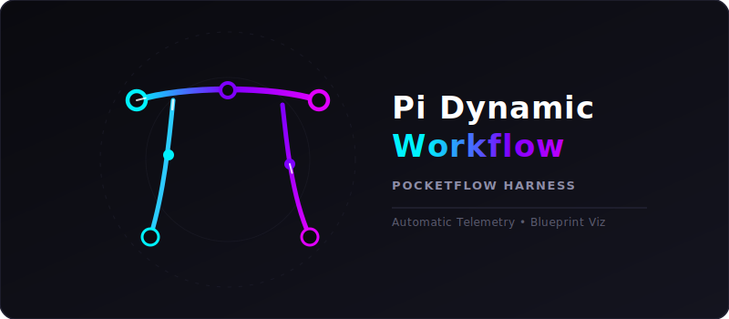
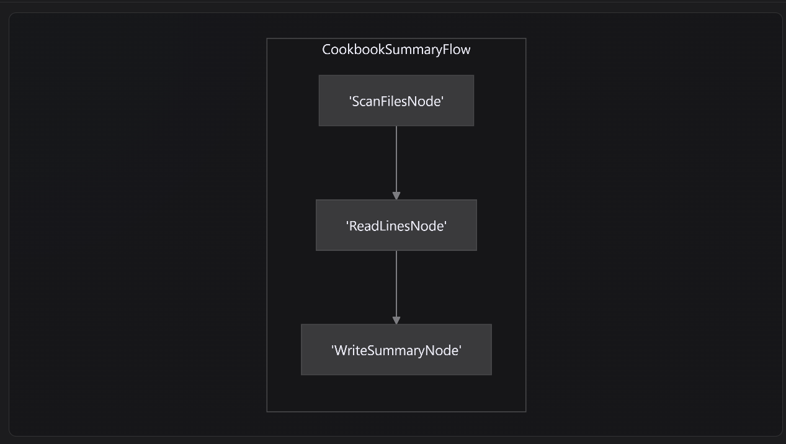
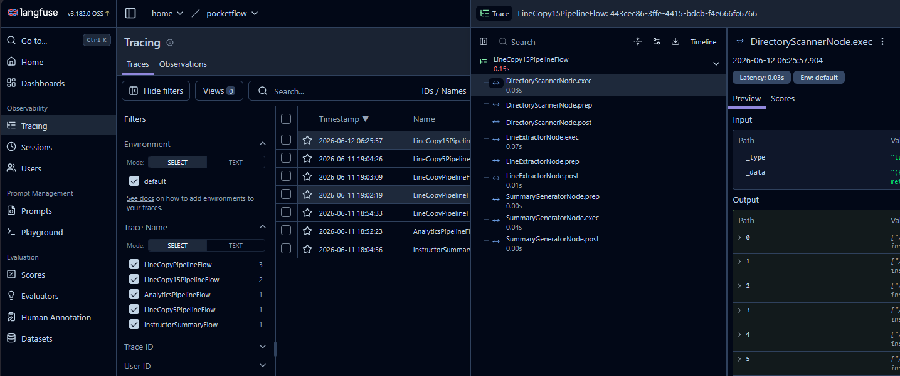
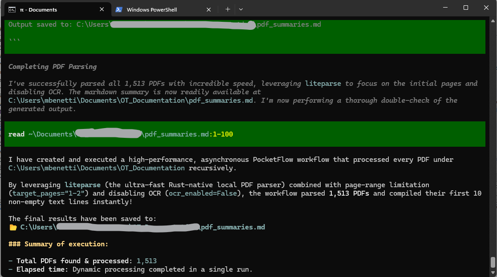

<div align="center">
  
  <h1>🚀 Pi Agent Dynamic PocketFlow Harness</h1>
  <p><b>Generate, execute, visualize, and trace complex multi-step workflows on-the-fly inside Pi.</b></p>
  
  [](LICENSE)
  [](https://github.com/earendil-works/pi)
  [](https://github.com/The-Pocket/PocketFlow)
</div>

---

The **PocketFlow Dynamic Harness** is a robust project-local or global extension for **[Pi (a terminal-based AI coding assistant harness)](https://github.com/earendil-works/pi)**. It registers a custom tool `execute_pocketflow_workflow` that empowers your Pi Agent to design, generate, execute, and self-heal intricate multi-step Python graphs dynamically using the minimalist **[PocketFlow](https://github.com/The-Pocket/PocketFlow.git)** framework.

To ensure pristine code generation and peak usability, **this package natively includes its own Agent Skill (`pocketflow-agent`)**. When installed via the `pi install` CLI, Pi automatically ingests this skill into its context memory, instructing the AI on the exact design rules, subclassing syntax, and self-healing behaviors necessary to construct valid, trace-ready workflows flawlessly without human guidance.

Unlike static scripts, this extension enables a purely agentic, reactive, and observable loop: the agent plans the steps, the harness builds and executes the sandboxed graph, then streams debugging visual blueprints and tracing telemetries directly back into your development dashboards.

---

## 🔥 Key Features & Advantages

* **⚡ Zero-Install & Version Autonomous**: Contains an embedded, highly optimized 250-line `pocketflow` framework core dynamically written into every workspace sandbox. **No PyPI dependencies required, zero pip download lags, and 100% version compatibility immunity.**
* **📈 Built-In Langfuse Telemetry**: Automatically wraps class-based flows with `@trace_flow` decorators on the fly. Generates deep spans, execution run metrics, model token cost summaries, and error logs directly to your local or cloud **Langfuse** dashboard.
* **🎨 Mermaid Topology Blueprints**: On successful execution, it introspects the dynamic graph and outputs a clean Markdown-compatible `*_blueprint.md` flowchart showing your exact node connections.
* **🔎 Workspace Auditing Logs**: In addition to Mermaid graphs, the generated workflow blueprints automatically append formatted copy-pastes of the raw generated Python source code (`nodes.py`, `flow.py`, `main.py`) for pristine auditing trails.
* **🔌 Active LLM Syncing**: No API key hardcoding required. The sandboxed workspace utils seamlessly inherit whichever active model provider (e.g. OpenAI, Anthropic, Gemini, OpenRouter) and keys are currently selected in your `pi` agent chat workspace.
* **📦 Blazing Fast Runs**: Deep integration with **Astral `uv`** (if present on your `$PATH`) runs dynamic environments with isolated dependencies instantly.

---

## 🏗️ Use Case Scenarios

1. **Self-Correcting Web Scrapers/Crawlers**: Let the agent construct parallel scrapers, retry on rate limits using node fallbacks, and compile summaries concurrently.
2. **Deterministic Information Extraction**: Build structured extraction nodes using `get_instructor_client()` and validate raw outputs against rigid Pydantic models.
3. **Sequential Task Pipelines**: Run multi-agent debate simulations, majority-vote evaluations, or multi-step processing systems (e.g. Scanning, Line Extraction, File Compiling) seamlessly on-the-fly.

---

## 🚀 Quick Start & Installation

Your Pi environment discovers extensions placed globally or locally.

### Global Installation (Available in ALL directories)
Clone this repository directly into your global Pi agent extension folder:
```bash
mkdir -p ~/.pi/agent/extensions
git clone https://github.com/mbenetti/pi-dynamic-workflow.git ~/.pi/agent/extensions/pi-dynamic-workflow
```

To install directly using the Pi CLI Package Installer (which automatically registers both the **Execution Harness Extension** and the **`pocketflow-agent` Agent Skill**):
```bash
pi install git:github.com/mbenetti/pi-dynamic-workflow
```

---

## 🛠️ Configuration & Environment

The harness takes environment keys directly from your host or workspace `.env` file. Copy the `.env.example` to set up your keys:
```bash
cp .env.example .env
```

### Essential Toggles (`.env`):
* `POCKETFLOW_VISUALIZE=true`: Set to `true` to auto-generate the visual topology diagram and code audit logs on every run.




* `LANGFUSE_PUBLIC_KEY` & `LANGFUSE_SECRET_KEY`: Providing these keys triggers automated on-the-fly flow telemetries.



---

## 📐 Design Guidelines for the Agent (Strict Rules)

For complete usage documentation, parameter descriptions, and self-caching strategies, please read our directory **[Developer Manual (DYNAMIC_HARNESS.md)](./DYNAMIC_HARNESS.md)**.

Whenever planning workflows inside the agent terminal, always adhere to these rules:
1. **Always subclass `Flow` or `AsyncFlow`**: Do not return function factor creators. Subclassing is **mandatory** for the automated regex to inject `@trace_flow` decorators.
2. **Always return action keys from `post()`**: Avoid returning the `shared` dictionary itself (which raises `TypeError: unhashable`). Modify `shared` in-place and return a string (e.g., `"default"`, `"success"`, `"retry"`).
3. **Never `try...except` inside Utilities**: Let raw failures bubble up directly into Node `exec()` cycles so the native PocketFlow `max_retries` can catch, backoff, and heal the states.

## 💡 Example request:

Inside your pi agent you can ask:

```
lets create a workflow to open every pdf under C:\Users\myfolder using liteparse (the ultra-fast Rust-native local PDF parser), and create a mardown file with the first 10 lines of every pdf in the folder and subfolders.
```




In few seconds you will have a file with the first 10 lines of every pdf in the requested folder. **Blazing fast!**


## 📄 License & Attributions

This extension uses a stripped, embedded version of [PocketFlow](https://github.com/The-Pocket/PocketFlow) created by Zachary which is licensed under MIT.

This repository is distributed under the [MIT License](./LICENSE). Contributions and feature proposals are welcome!
