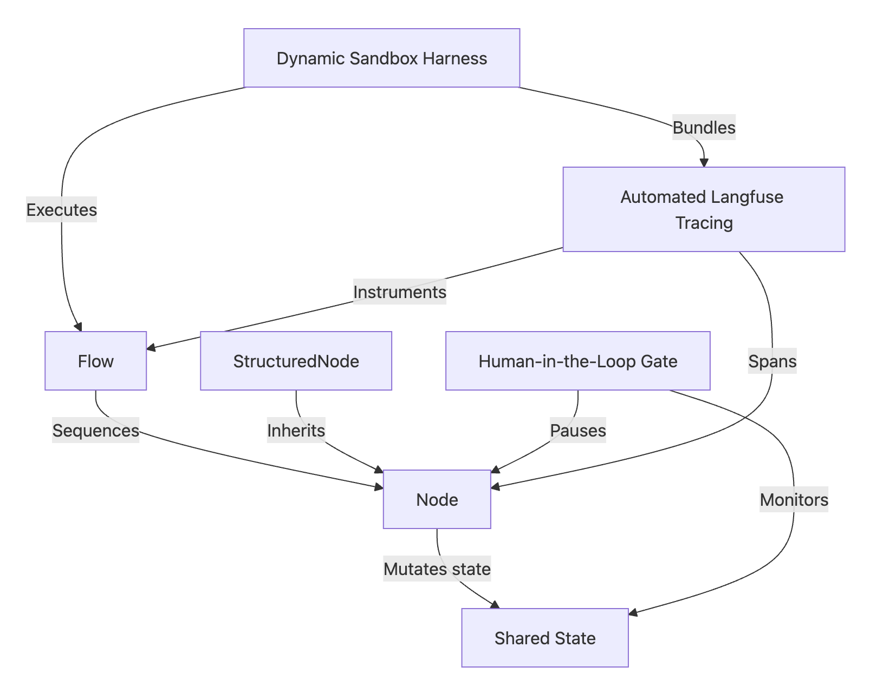

<div align="center">
  
  <h1>🚀 Pi Agent Dynamic PocketFlow Harness</h1>
  <p><b>Generate, execute, visualize, and trace complex multi-step workflows on-the-fly inside Pi.</b></p>
  
  [](LICENSE)
  [](https://github.com/earendil-works/pi)
  [](https://github.com/The-Pocket/PocketFlow)
</div>

---

The **PocketFlow Dynamic Harness (`pocketflow-harness.ts`)** is a Pi Extension that provides a **zero-overhead, zero-config local sandbox** for dynamic workflow generation. It streamlines agent-driven development by addressing common challenges in local execution:

1. **Dynamic state extraction**: Automatically detects and syncs with Pi’s active LLM model, provider, and API keys.
2. **Framework containment**: Injects a lightweight, local Python emulation of the `pocketflow` core and `tracing` modules on the fly, avoiding global dependency conflicts.
3. **Speed & Package Isolation**: Leverages the native Astral `uv` toolchain for fast execution, with automatic fallback to isolated virtualenv `pip` installs.
4. **Topology diagnostics**: Uses transparent runtime introspection to generate clear Mermaid blueprint diagrams of the executed workflow.

To ensure pristine code generation and peak usability, **this package natively includes its own Agent Skill (`pocketflow-agent`)**. When installed via the `pi install` CLI, Pi automatically ingests this skill into its context memory, instructing the AI on the exact design rules, subclassing syntax, and self-healing behaviors necessary to construct valid, trace-ready workflows flawlessly without human guidance.

Unlike static scripts, this extension enables a purely agentic, reactive, and observable loop: the agent plans the steps, the harness builds and executes the sandboxed graph, then streams debugging visual blueprints and tracing telemetries directly back into your development dashboards.

---
## Project structure



---
## 🔥 Key Features & Advantages

* **🔄 Interactive Workspace Rerun (New!)**: Rerun your compiled sandboxes at any time. Features manual TUI arrow-key selectors (`/pocketflow` Slash Command) and agent-driven recalls (*"Rerun workspace_md_scanner"*).
* **⚙️ Persistent Metadata Indexing (New!)**: Programmatically compiles a `metadata.json` descriptor file within every sandbox, preserving descriptive objectives, inputs, outputs, and dependencies for future auditing.
* **⚡ Decoupled & Zero-Install Autonomous**: Contains highly optimized embedded versions of both the **PocketFlow Core Engine** and the **Langfuse Tracing wrapper** dynamically populated inside every workspace sandbox. **No PyPI package installations, zero pip download lags, 100% version compatibility immunity, and completely transparent local execution without any local files of 'pocketflow-tracing'.**
* **📈 Transparent Langfuse Telemetry**: Automatically instruments flows natively using thread-safe `contextvars`. Generates deep spans, execution run metrics, model token cost summaries, and error logs directly to your local or cloud **Langfuse** dashboard. If tracking is disabled or credentials are omitted, tracing gracefully runs in quiet/no-op mode with no runtime overhead or import errors.
* **🎨 Mermaid Topology Blueprints**: On successful execution, it introspects the dynamic graph and outputs a clean Markdown-compatible `*_blueprint.md` flowchart showing your exact node connections.
* **🔎 Workspace Auditing Logs**: In addition to Mermaid graphs, the generated workflow blueprints automatically append formatted copy-pastes of the raw generated Python source code (`nodes.py`, `flow.py`, `main.py`) for pristine auditing trails.
* **🔌 Active LLM Syncing**: No API key hardcoding required. The sandboxed workspace utils seamlessly inherit whichever active model provider (e.g. OpenAI, Anthropic, Gemini, OpenRouter) and keys are currently selected in your `pi` agent chat workspace.
* **📦 Blazing Fast Runs**: Deep integration with **Astral `uv`** (if present on your `$PATH`) runs dynamic environments with isolated dependencies instantly.

---

## 🔄 Interactive Rerun & Workspace Discovery

To convert dynamic workflow generation from one-time "disposable" scripts into a **persistent, reusable workbench**, the harness now includes built-in state logging, slash commands, and agent-driven rerun capabilities:

* **⚙️ Persistent Metadata Logging**: Every workflow execution automatically compiles and saves a `metadata.json` descriptor file within its sandbox directory. This preserves task names, user descriptions, requirements, and timestamps.
* **📱 Manual Slash Command (`/pocketflow`)**: Launch your saved workflows manually at any time! Type `/pocketflow` directly in your Pi console to pull open a beautiful, arrow-key interactive TUI selection menu displaying your saved workflows and descriptions. Press enter to spin up the subprocess instantly with live ANSI-scrubbed logger outputs streamed directly to your terminal.
* **🤖 LLM Agent-Driven Recalls**: Want to run a workspace workflow conversationally? Simply ask the agent: *"Rerun workspace_md_scanner"*. The agent will invoke the registered `rerun_pocketflow_workflow` tool, and the Pi harness will execute the task, presenting the results inside a beautiful collapsible tool box with its collapsible icons.
* **📂 Workspace Discoverability**: The LLM agent can call `list_pocketflow_workflows` to list all available cached workflows along with their objective descriptions and original prompts.

---

## 🏗️ Use Case Scenarios

1. **Self-Correcting Web Scrapers/Crawlers**: Let the agent construct parallel scrapers, retry on rate limits using node fallbacks, and compile summaries concurrently.
2. **Deterministic Information Extraction**: Build structured extraction nodes using `get_instructor_client()` and validate raw outputs against rigid Pydantic models.
3. **Sequential Task Pipelines**: Run multi-agent debate simulations, majority-vote evaluations, or multi-step processing systems (e.g. Scanning, Line Extraction, File Compiling) seamlessly on-the-fly.
4. Any task that bloat the context of the LLM. Information that is not necessary and can polute the context.
---

## 🚀 Quick Start & Installation

Your Pi environment discovers extensions placed globally or locally.

### Local Project Installation (Recommended for this workspace)
If you want to run and use the harness locally inside your current repository, simply link or copy the extension file into your project's local `.pi/extensions` directory:

When you start `pi` in this directory, select **Yes** when prompted to "Trust project?" to load project-local extensions automatically.

### Local Installation (Available only inside the folder)
Clone this repository directly into your global Pi agent extension folder:
```bash
git clone https://github.com/mbenetti/pi-dynamic-workflow.git
cd pi-dynamic-workflow/
pi
```

### Global Installation (Available in any directory)
To install directly using the Pi CLI Package Installer (which automatically registers both the **Execution Harness Extension** and the **`pocketflow-agent` Agent Skill**):
```bash
pi install git:github.com/mbenetti/pi-dynamic-workflow
pi
```

---

## 🛠️ Configuration & Environment

The harness takes environment keys directly from your host or workspace `.env` file. Copy the `.env.example` to set up your keys:
```bash
cp .env.example .env
```

### Essential Toggles (`.env`):
* `POCKETFLOW_VISUALIZE=true`: Set to `true` to auto-generate the visual topology diagram and code audit logs on every run.

### Zero-Config Tracing Decoupling:
What makes this implementation truly production-grade is its complete separation from local dependencies:
1. **Always Embedded**: Every execution automatically bundles both `pocketflow` and its `tracing` companion subdirectories inside the sandbox (`.pi/pocketflow/<task_name>/pocketflow/` and `.pi/pocketflow/<task_name>/tracing/`).
2. **Transparent contextvars-powered Logging**: PocketFlow core classes natively monitor node execution timings, inputs, outputs, exceptions, and overall flow topology. By utilizing Python's thread-safe and async-safe `contextvars` module, logging remains perfectly isolated across concurrent flow threads. If Langfuse is not installed in the micro-env, or if credentials are left blank in `.env`, the pre-bundled tracer automatically degrades to a seamless, silent no-op. It avoids any runtime crashes or import blocking!
3. **No Outer File Leakage**: The extension automatically loads system env variables and forwards them down to the running workflow. You will never need to read, open, or hardcode environment paths to run traced graphs.


* `LANGFUSE_PUBLIC_KEY` & `LANGFUSE_SECRET_KEY`: Providing these keys triggers automated on-the-fly flow telemetries.


## 💡 Example request:

Inside your pi agent you can ask:

```
let's create a workflow to open every pdf under C:\Users\myfolder using liteparse (the ultra-fast Rust-native local PDF parser), and create a mardown file with the first 10 lines of every pdf in the folder and subfolders.
```


In few seconds you will have a file with the first 10 lines of every pdf in the requested folder. **Blazing fast!**


## The repository include a Ai generated tutorial to understand every aspect of the project and the internals of the code base.

### Chapters:

0. [Index](Tutorials/00_index.md)
1. [Shared State (Communication Channel)](Tutorials/01_shared_state.md)
2. [The Node (Execution Unit)](Tutorials/02_node.md)
3. [The Flow (Graph Orchestrator)](Tutorials/03_flow.md)
4. [Structured Nodes (Schema Enforcement)](Tutorials/04_structurednode.md)
5. [Human-in-the-Loop (HITL) Loops](Tutorials/05_human_in_the_loop_gate.md)
6. [Dynamic Sandbox Harness](Tutorials/06_dynamic_sandbox_harness.md)
7. [Automated Langfuse Tracing](Tutorials/07_automated_langfuse_tracing.md)


## 🗺️ Extended Roadmap (Workspace Reuse & Composition)

PocketFlow Dynamic Harness is engineered to move from raw code generation to persistent execution frameworks. Future updates will focus on harvesting and composing the local sandboxed environments:

#### 1. Agentic Composition (Sub-Workflow Orchestration)
Build native bridging schemas allowing new workflow nodes to import, invoke, and pass shared states directly to existing workspace flows. For example, a `MasterFlow` importing `.pi/pocketflow/scraper/flow.py` as an encapsulated subprocess.

#### 2. Workflow Caching (Short-Circuit Execution)
Allow the Pi Agent to index past workspaces (`.pi/pocketflow/*`) and intelligently "short-circuit" execution. When a matching request is made, the agent will verify caching validity and execute `main.py` directly in some milliseconds, bypassing LLM compilation overhead completely.

#### 3. Native Cron/Scheduler Daemon
Introduce a helper CLI command `pocketflow schedule <task_name> --cron="0 9 * * 1"` that dynamically configures local OS cron tasks or launchd scripts for automatic, scheduled executions of your pre-built workspaces.

---

## 📄 License & Attributions

This extension uses a stripped, embedded version of [PocketFlow](https://github.com/The-Pocket/PocketFlow) created by Zachary which is licensed under MIT.

This repository is distributed under the [MIT License](./LICENSE). Contributions and feature proposals are welcome!
