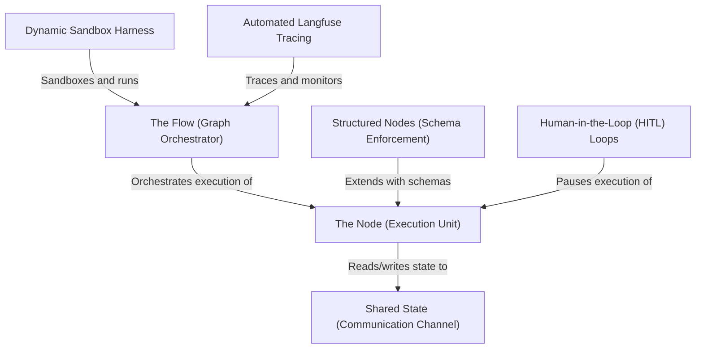

# Tutorial: pi-dynamic-workflow

The **pi-dynamic-workflow** project is an on-the-fly execution and tracing environment built for the Pi Agent. It enables the dynamic generation, execution, and visualization of complex AI agent workflows using the **PocketFlow** framework. 

By utilizing a lightweight *Dynamic Sandbox Harness* powered by the fast `uv` toolchain, it allows agents to run structured multi-step pipelines containing **Structured Nodes** (for guaranteed schema extraction) and **Human-in-the-Loop (HITL)** checkpoints. Standardized telemetry and execution metrics are automatically captured via thread-safe, decoupled **Langfuse Tracing** without crashing when credentials are absent.

**Source Repository:** [https://github.com/mbenetti/pi-dynamic-workflow.git](https://github.com/mbenetti/pi-dynamic-workflow.git)

## Chapters

1. [Shared State (Communication Channel)
](01_shared_state__communication_channel__.md)
2. [The Node (Execution Unit)
](02_the_node__execution_unit__.md)
3. [The Flow (Graph Orchestrator)
](03_the_flow__graph_orchestrator__.md)
4. [Structured Nodes (Schema Enforcement)
](04_structured_nodes__schema_enforcement__.md)
5. [Human-in-the-Loop (HITL) Loops
](05_human_in_the_loop__hitl__loops_.md)
6. [Dynamic Sandbox Harness
](06_dynamic_sandbox_harness_.md)
7. [Automated Langfuse Tracing
](07_automated_langfuse_tracing_.md)

---

Generated by [AI Codebase Knowledge Builder](https://github.com/The-Pocket/Tutorial-Codebase-Knowledge)