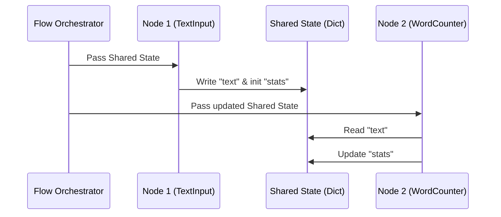

# Chapter 1: Shared State (Communication Channel)

Welcome to your first step in building dynamic workflows! In this chapter, we will explore the baseline foundation of how different steps in your workflow talk to one another: the **Shared State**.

---

## The Assembly Line Analogy

Imagine you are managing a toy factory assembly line. 

```
[Worker 1: Painter] ---> (Throws wet toy) ---> [Worker 2: Packager] ❌ (Messy!)
```

If the Painter throws a wet, half-painted toy directly at the Packager, things get messy quickly. The Packager might drop it, get paint on their hands, or not be ready to catch it. 

Instead, smart factories use a **shared tray** that moves along a conveyor belt:

```
[Painter] ---> Puts toy on [ Shared Tray ] ---> [Packager] ---> Takes toy from [ Shared Tray ]  ✅ (Clean!)
```

The Painter places the painted toy onto the tray. The Packager picks up the toy from the tray when they are ready, packages it, and puts it back. 

In `pi-dynamic-workflow`, this shared tray is called the **Shared State**. 

---

## What is the Shared State?

In code, the Shared State is nothing more than a standard Python dictionary (`{}`) passed from step to step (which we call "Nodes"). 

Instead of steps passing outputs directly to each other using complex function inputs and outputs, they read their inputs from this central dictionary and write their results back into it.

### Why is this incredibly useful?
1. **No Spaghetti Code**: You don’t have to worry about matching function arguments between dozens of steps.
2. **Single Source of Truth**: There is only one place where your workflow's data lives.
3. **Easy Debugging**: At any moment, you can print this single dictionary to see exactly what your workflow knows.

---

## Our Central Use Case: A Word Stats Tracker

To see this in action, let's build a simple workflow that:
1. Takes a sentence.
2. Counts the words.
3. Keeps track of running statistics (total texts processed and total words counted).

Let's look at how we initialize and use our "shared tray" to solve this.

### Step 1: Initializing the Shared State
We start by defining what our shared dictionary looks like at the very beginning.

```python
# Initialize our shared state dictionary
shared = {
    "text": "Hello world from PocketFlow",
    "stats": {
        "total_texts": 0,
        "total_words": 0
    }
}
```

*What's happening here?*  
We created our tray (`shared`). It currently holds the raw `text` we want to process, and an empty `stats` tracker ready to hold our running tallies.

### Step 2: Reading from the Shared State
When a workflow step runs, it looks inside the shared state to grab what it needs.

```python
# Inside our Word Counter node
def prep(self, shared):
    # Grab the text from the shared tray
    return shared["text"]
```

*What's happening here?*  
The step doesn't care who put the text there. It simply asks the `shared` dictionary: *"Give me whatever is under the key `'text'`."*

### Step 3: Writing back to the Shared State
Once a step finishes its calculation, it saves its results back onto the tray.

```python
def post(self, shared, prep_res, exec_res):
    # Update our running count inside the shared state
    shared["stats"]["total_words"] += exec_res
    return "default"
```

*What's happening here?*  
Our step calculated the number of words (`exec_res`). It directly updates the `stats` dictionary stored inside our `shared` state so that future steps can see the updated total.

---

## How It Works Under the Hood

Let's look at how the data flows behind the scenes as the orchestrator moves our shared state from one step to the next.



1. **The Orchestrator** starts the run and creates the `shared` dictionary.
2. **Node 1 (TextInput)** receives the dictionary, grabs user input, writes it to `shared["text"]`, and passes it back.
3. **The Orchestrator** takes that exact same dictionary and hands it to **Node 2 (WordCounter)**.
4. **Node 2** reads the text, counts the words, and updates `shared["stats"]`.

Because they both reference the *same* dictionary in memory, any change made by one node is instantly visible to the next!

---

## Crucial Rule: Never Return the Shared State!

When a node finishes its work, it must return an **action string** (like `"default"` or `"success"`) to tell the flow where to go next. 

**Do NOT return the `shared` dictionary itself!**

```python
# ❌ INCORRECT - This will cause an error!
def post(self, shared, prep_res, exec_res):
    shared["output"] = exec_res
    return shared 

#  CORRECT - Update in-place, return a string!
def post(self, shared, prep_res, exec_res):
    shared["output"] = exec_res
    return "default"
```

If you return the dictionary instead of a string, the orchestrator will get confused trying to route to the next step and crash.

---

## Conclusion

The **Shared State** is the glue of your workflow. By using a simple Python dictionary as a shared tray, your steps remain completely independent, easy to test, and simple to debug.

Now that you know how steps *communicate* using the Shared State, let's learn how to actually build one of these steps! Head over to **[Chapter 2: The Node (Execution Unit)](02_the_node__execution_unit__.md)** to see how execution units are structured.

---

Generated by [AI Codebase Knowledge Builder](https://github.com/The-Pocket/Tutorial-Codebase-Knowledge)