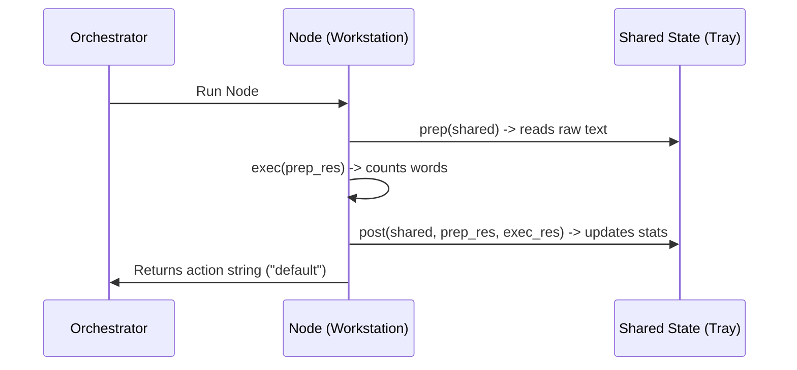

# Chapter 2: The Node (Execution Unit)

In [Chapter 1: Shared State (Communication Channel)](01_shared_state__communication_channel__.md), we learned how steps in a workflow communicate using a "shared tray" (the Shared State). 

But who is actually doing the work? Who reads from this tray, processes the data, and writes the results back? 

Meet **The Node**—the fundamental execution unit of PocketFlow.

---

## The Workstation Analogy

Think of a Node as a **workstation on a factory floor**. 

```
   [ Shared State Tray ]
      |            ^
  1. prep()     3. post()
      v            |
   [  Node Workstation  ]
   [    2. exec()       ]
```

To keep the factory running smoothly, every workstation worker follows a strict, three-step routine:
1. **`prep` (Gather)**: Pick up raw materials from the shared tray.
2. **`exec` (Execute)**: Perform the actual task at the desk (like painting, assembling, or running a calculation).
3. **`post` (Record & Signal)**: Put the finished product back on the shared tray and signal that the job is done.

By dividing a single step into three distinct phases, your code becomes incredibly clean, isolated, and easy to test. If something breaks, you know exactly which phase failed!

---

## Our Central Use Case: The Word Counter Node

Let's build a Node that counts the words in a sentence. 

We will break down this Node into its three phases, keeping our code blocks extremely simple and easy to understand.

### Step 1: Defining the Node Class
First, we import the `Node` class and create our own custom workstation:

```python
from pocketflow import Node

class WordCounterNode(Node):
    # This is our custom workstation!
    pass
```
*What's happening here?*  
We are creating a new class called `WordCounterNode` that inherits all the clever workflow powers of PocketFlow's base `Node`.

### Step 2: The `prep` Phase (Gathering Data)
Next, we write the `prep` method to grab the text we need from the `shared` dictionary:

```python
# Inside WordCounterNode:
def prep(self, shared):
    # Grab raw text from the shared tray
    return shared["text"]
```
*What's happening here?*  
The `prep` phase is only responsible for looking at the shared state and returning the specific piece of data we need. 

### Step 3: The `exec` Phase (Doing the Work)
Now, we write the `exec` method to do the actual calculation:

```python
# Inside WordCounterNode:
def exec(self, prep_res):
    # Count words in the text
    words = prep_res.split()
    return len(words)
```
*What's happening here?*  
The `exec` phase receives whatever `prep` returned (which we call `prep_res`). It doesn't know anything about the `shared` dictionary! This isolation makes it incredibly easy to test this specific calculation by itself.

### Step 4: The `post` Phase (Saving and Routing)
Finally, we write the `post` method to update our running totals and signal completion:

```python
# Inside WordCounterNode:
def post(self, shared, prep_res, exec_res):
    # Update the stats in our shared state
    shared["stats"]["total_words"] += exec_res
    return "default"
```
*What's happening here?*  
The `post` phase receives the original `prep_res` and the calculated `exec_res`. It updates the shared dictionary and returns `"default"`. This string tells the workflow engine where to route the execution next.

---

## How It Works Under the Hood

When PocketFlow executes a Node, it coordinates the three phases sequentially behind the scenes.



1. **The Orchestrator** triggers the Node's execution.
2. **`prep`** runs, pulling data out of the Shared State.
3. **`exec`** runs, processing that data in isolation.
4. **`post`** runs, writing the output back to the Shared State.
5. The Node returns a routing signal (like `"default"`) back to the Orchestrator.

---

## Why is this Separation Awesome? (Self-Healing & Retries)

Because the `exec` phase is completely isolated from the shared state, PocketFlow can easily **retry** a failed step without messing up your data!

If an external API call or database query fails inside `exec`, PocketFlow knows it can safely run `exec` again with the same `prep_res` inputs.

```python
# Retry up to 3 times automatically!
counter = WordCounterNode(max_retries=3)
```

If `exec` fails, PocketFlow waits a moment and tries again, up to 3 times, before giving up. Your data stays safe and uncorrupted because the shared state is never touched until `post` runs successfully!

---

## Conclusion

By breaking our workflow steps into **Nodes** with `prep`, `exec`, and `post` phases, we gain:
* **Safety**: Code is isolated and easy to debug.
* **Resilience**: Failed steps can be retried automatically.
* **Clarity**: Each phase has exactly one job.

Now that we know how to build individual workstations (Nodes) and pass data between them (Shared State), it's time to connect them together! 

Head over to **[Chapter 3: The Flow (Graph Orchestrator)](03_the_flow__graph_orchestrator__.md)** to see how we build the actual factory assembly line.

---

Generated by [AI Codebase Knowledge Builder](https://github.com/The-Pocket/Tutorial-Codebase-Knowledge)