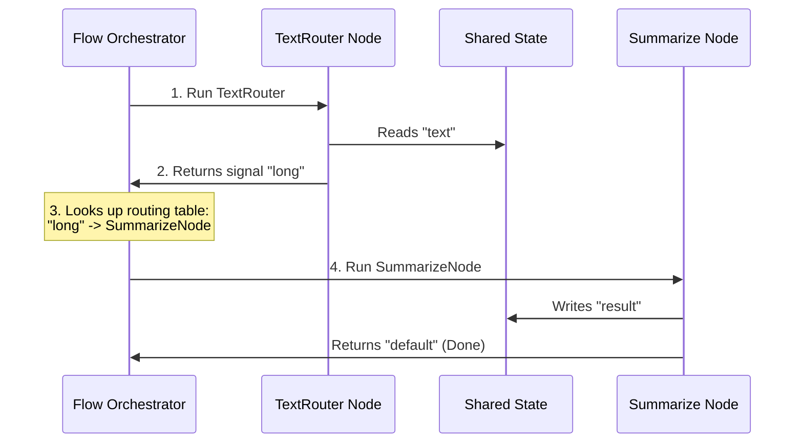

# Chapter 3: The Flow (Graph Orchestrator)

In [Chapter 2: The Node (Execution Unit)](02_the_node__execution_unit__.md), we learned how to build individual workstations (Nodes) that perform specific tasks. We also know from [Chapter 1: Shared State (Communication Channel)](01_shared_state__communication_channel__.md) that these nodes use a shared dictionary to communicate. 

But how do we connect these individual workstations into a fully automated factory assembly line? Who decides which workstation runs first, and where the materials go next?

Meet **The Flow**—the assembly line supervisor of PocketFlow.

---

## The Assembly Line Supervisor Analogy

Imagine your workstations are set up on the factory floor. Without a supervisor, the machines just sit idle. 

```
[ Workstation A ]       [ Workstation B ]       [ Workstation C ]
        ^                       ^                       ^
        └───────────────────────┴───────────────────────┘
                     (No one directing traffic!)
```

The **Flow** acts as the supervisor who:
1. Points to the starting workstation and says, *"Start here!"*
2. Waits for a workstation to finish and listen for its completion signal (like `"success"`, `"failure"`, or custom signals).
3. Reroutes the conveyor belt to the next workstation based on that signal.

```
                  [ Supervisor (Flow) ]
                            │
            ┌───────────────┴───────────────┐
            ▼ (If "long")                   ▼ (If "short")
    [ Workstation B ]               [ Workstation C ]
```

Because the supervisor is smart, your assembly lines don't have to be simple straight lines. They can branch into decision trees, loop back to retry failed steps, or even contain entire "sub-assembly lines" inside them!

---

## Our Central Use Case: The Smart Text Analyzer

Let's build a workflow that analyzes a piece of text. 
* If the text is **long** (more than 5 words), we route it to a node that summarizes it.
* If the text is **short** (5 words or fewer), we route it to a node that outputs it directly.

Let's see how we can build this branching factory line using **The Flow**.

### Step 1: Building our Router Node
First, we need a Node that inspects the text and returns a signal string (`"long"` or `"short"`) from its `post` phase.

```python
from pocketflow import Node

class TextRouter(Node):
    def prep(self, shared):
        return shared["text"]
    def exec(self, text):
        return len(text.split())
    def post(self, shared, prep_res, exec_res):
        if exec_res > 5:
            return "long"
        return "short"
```
*What's happening here?*  
This node counts the words. In the `post` phase, it returns either `"long"` or `"short"`. These strings are the signals our Flow supervisor will listen for.

### Step 2: Creating the Destination Nodes
Next, we create two simple nodes to handle our branches:

```python
class SummarizeNode(Node):
    def post(self, shared, prep, exec):
        shared["result"] = "Summarized Text!"
        return "default"

class DirectNode(Node):
    def post(self, shared, prep, exec):
        shared["result"] = shared["text"]
        return "default"
```
*What's happening here?*  
One node simulates summarizing the text, and the other simply copies the original text directly to our results.

### Step 3: Connecting the Nodes in a Flow
Now, we create our Flow. In PocketFlow, the best practice is to subclass `Flow` directly. This allows visualization tools to automatically map your workflow!

We connect nodes using the `>>` operator for default sequences, and the `- "signal" >>` operator for branching:

```python
from pocketflow import Flow

class AnalyzerFlow(Flow):
    def __init__(self):
        r, s, d = TextRouter(), SummarizeNode(), DirectNode()
        
        # If r returns "long", go to s. If "short", go to d.
        r - "long" >> s
        r - "short" >> d
        
        super().__init__(start=r)
```
*What's happening here?*  
1. We instantiate our nodes (`r`, `s`, and `d`).
2. We define the routing rules using the `- "signal" >>` operator.
3. We call `super().__init__(start=r)` to tell the supervisor to start execution at the `r` (Router) node. **Note:** Always use the parameter name `start`, never `start_node`!

### Step 4: Running the Flow
Now we can run our completed assembly line:

```python
flow = AnalyzerFlow()
shared = {"text": "This is a super long sentence."}

flow.run(shared)
print(shared["result"]) # Output: Summarized Text!
```
*What's happening here?*  
We pass our `shared` state into `flow.run()`. The supervisor starts at `TextRouter`, receives the `"long"` signal, routes the state to `SummarizeNode`, finishes, and updates our shared state!

---

## How It Works Under the Hood

Let's look at the sequence of events when you call `flow.run(shared)`:



1. **The Flow Orchestrator** reads the `start` parameter and triggers the `TextRouter`.
2. `TextRouter` reads the text, counts the words, and returns the signal `"long"` back to the orchestrator.
3. The orchestrator checks its internal dictionary of connections. It sees that `"long"` points to `SummarizeNode`.
4. The orchestrator hands the shared state to `SummarizeNode`, which writes the final result. Since `SummarizeNode` has no further connections, the flow ends.

---

## Advanced Concept: Sub-Assembly Lines (Nesting)

One of the most powerful features of PocketFlow is that **a Flow is also a Node**. 

Because `Flow` inherits from the base `Node` class, you can treat an entire complex Flow as a single step inside a larger Flow! This allows you to build infinitely complex hierarchical AI systems out of clean, simple sub-graphs.

```python
class MainWorkflow(Flow):
    def __init__(self):
        input_node = InputNode()
        analyzer_subflow = AnalyzerFlow() # A Flow used as a Node!
        output_node = OutputNode()
        
        # Connect them linearly
        input_node >> analyzer_subflow >> output_node
        super().__init__(start=input_node)
```

*What's happening here?*  
`analyzer_subflow` contains our entire branching, decision-making logic, but to `MainWorkflow`, it looks like a single step on the conveyor belt. This keeps your code incredibly modular and easy to manage!

---

## Conclusion

The **Flow** is the master coordinator of your AI applications. By using simple routing operators (`>>` and `-`), you can build:
* **Linear pipelines** for simple step-by-step tasks.
* **Branching trees** for decision-making.
* **Nested architectures** for complex, multi-agent hierarchies.

Now that we know how to coordinate nodes and route data, let's look at how to make our nodes even safer by enforcing strict data schemas. 

Head over to **[Chapter 4: Structured Nodes (Schema Enforcement)](04_structured_nodes__schema_enforcement__.md)** to see how we guarantee perfect outputs from our LLMs!

---

Generated by [AI Codebase Knowledge Builder](https://github.com/The-Pocket/Tutorial-Codebase-Knowledge)