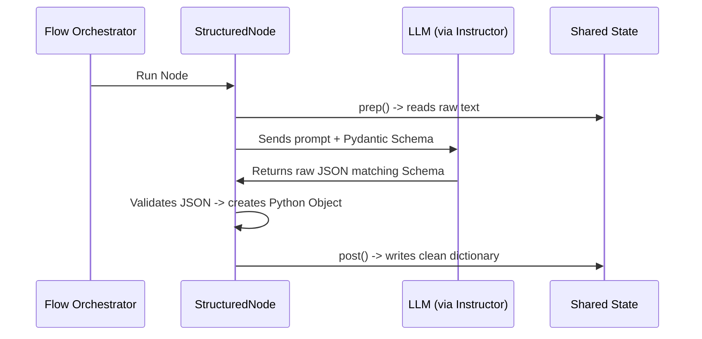

# Chapter 4: Structured Nodes (Schema Enforcement)

In [Chapter 3: The Flow (Graph Orchestrator)](03_the_flow__graph_orchestrator__.md), we learned how to connect our workstations into a fully automated assembly line. But when our workstations use Large Language Models (LLMs) to process text, we run into a major problem: **LLMs are unpredictable conversationalists.**

If you ask an LLM to output a number rating, it might say: *"Sure! Here is the rating: 5 stars."* 

This conversational "fluff" and markdown formatting will instantly break downstream nodes that expect a clean, raw integer. In this chapter, we will learn how to use **Structured Nodes** to force LLM outputs into exact, validated shapes.

---

## The Industrial Mold Analogy

Imagine you are baking cookies in your factory. 

```
[ Raw Cookie Dough ] ---> (Hand Shaped) ---> [ Unpredictable Cookies ] ❌ (Messy!)
```

If you let a machine hand-shape every cookie, some will be too big, some too small, and some completely misshapen. They won't fit into your packaging boxes!

To solve this, you use an **industrial cookie mold**:

```
[ Raw Cookie Dough ] ---> [ Industrial Mold ] ---> [ Perfectly Shaped Cookies ] ✅ (Exact!)
```

No matter how squishy or uneven the raw dough is, the mold forces it into the exact shape required. 

In PocketFlow, a **Structured Node** is that industrial mold. It uses two powerful Python tools: **Pydantic** (to define the mold's shape) and **Instructor** (to force the LLM to fill the mold perfectly).

---

## Our Central Use Case: The Book Review Parser

Let's build a node that takes a messy, handwritten book review and extracts three clean pieces of information:
1. The **book title** (as a string).
2. The **rating** (as an integer between 1 and 5).
3. Whether the review is **positive** (as a boolean `True` or `False`).

Let's build this "mold" step-by-step using code blocks under 10 lines!

### Step 1: Defining the Mold (Pydantic Schema)
First, we define what our ideal output looks like using `pydantic`:

```python
from pydantic import BaseModel, Field

class BookReview(BaseModel):
    title: str = Field(description="Title of the book")
    rating: int = Field(description="Rating from 1 to 5")
    is_positive: bool = Field(description="True if positive")
```
*What's happening here?*  
We created a Pydantic model called `BookReview`. We defined the exact keys we need, their types (`str`, `int`, `bool`), and text descriptions that guide the LLM.

### Step 2: Creating the Structured Node
Next, we create our custom workstation by subclassing `StructuredNode` instead of the standard `Node` from [Chapter 2: The Node (Execution Unit)](02_the_node__execution_unit__.md):

```python
from pocketflow import StructuredNode

class ReviewParser(StructuredNode):
    def __init__(self, client):
        super().__init__(
            response_model=BookReview,
            client=client,
            model="gpt-4o"
        )
```
*What's happening here?*  
We initialize our structured node by passing it our `BookReview` schema, our API client, and the LLM model name. This tells the node exactly which mold to use.

### Step 3: Writing the `prep` Phase
Now we define the `prep` phase to extract the raw review from our [Chapter 1: Shared State (Communication Channel)](01_shared_state__communication_channel__.md):

```python
# Inside the ReviewParser class:
def prep(self, shared):
    # Retrieve raw text from the shared state
    return f"Analyze this review: {shared['review']}"
```
*What's happening here?*  
We grab the raw, messy review text from our shared tray and format it into a prompt for the LLM.

### Step 4: Writing the `post` Phase
Finally, we write the `post` phase to save our structured data:

```python
# Inside the ReviewParser class:
def post(self, shared, prep_res, exec_res):
    # exec_res is already a validated BookReview object!
    shared["data"] = exec_res.model_dump()
    return "default"
```
*What's happening here?*  
Because this is a `StructuredNode`, the `exec_res` is **not** raw conversational text. It is a fully validated Python object matching our `BookReview` schema! We convert it to a dictionary and save it to the shared state.

### Step 5: Running our Structured Node
Let's see our structured node in action:

```python
from utils import get_instructor_client

client = get_instructor_client()
parser = ReviewParser(client)
shared = {"review": "Loved 'The Hobbit'! 5 stars!"}

parser.run(shared)
print(shared["data"])
# Output: {'title': 'The Hobbit', 'rating': 5, 'is_positive': True}
```
*What's happening here?*  
We pass a messy text string into our node. The node runs, communicates with the LLM, parses the output, and saves a perfectly clean dictionary in our shared state!

---

## How It Works Under the Hood

When you execute a `StructuredNode`, PocketFlow coordinates the validation process automatically behind the scenes.



1. **The Orchestrator** starts the node.
2. The node runs `prep()` to get the raw text prompt.
3. The node automatically hands the prompt and your Pydantic schema to the **Instructor** client.
4. **Instructor** forces the LLM to output clean JSON matching your schema, stripping away all conversational fluff.
5. The node validates the JSON. If valid, it converts it to a Python object and hands it to `post()`.
6. `post()` saves the clean, typed data back to the **Shared State**.

### Self-Healing Validation
If the LLM makes a mistake and returns invalid data (e.g., a string instead of an integer for `rating`), `StructuredNode` doesn't just crash. Under the hood, it automatically sends the error traceback *back* to the LLM and asks it to correct its own mistake! It will try this self-healing cycle up to your configured `max_retries` before giving up.

---

## Conclusion

By using **Structured Nodes**, you protect your workflows from the unpredictable nature of LLM text. You get:
* **Guaranteed Types**: If you expect an integer, you get an integer.
* **No Fluff**: No conversational preambles or markdown code blocks.
* **Self-Healing**: Automatic retries if the LLM output fails validation.

Now that we can guarantee perfect, structured data from our AI models, let's explore how we can pause our automated workflows to ask for human guidance.

Head over to **[Chapter 5: Human-in-the-Loop (HITL) Loops](05_human_in_the_loop__hitl__loops_.md)** to see how we build interactive AI applications!

---

Generated by [AI Codebase Knowledge Builder](https://github.com/The-Pocket/Tutorial-Codebase-Knowledge)