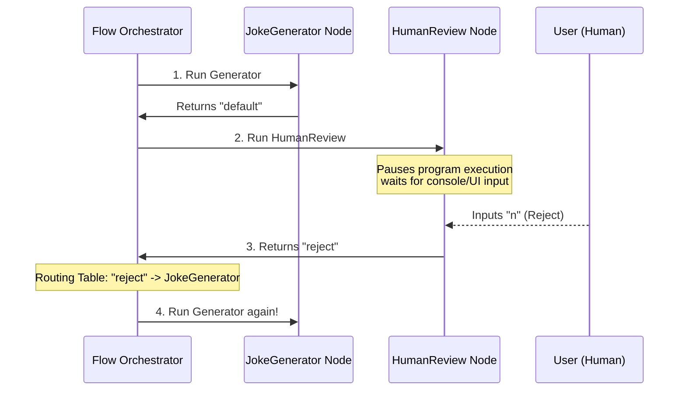

# Chapter 5: Human-in-the-Loop (HITL) Loops

In [Chapter 4: Structured Nodes (Schema Enforcement)](04_structured_nodes__schema_enforcement__.md), we learned how to use industrial molds (schemas) to force Large Language Models (LLMs) to output perfect, structured data. 

But even with perfect structure, AI can sometimes write content that is factually incorrect, off-brand, or just plain unfunny. How do we prevent these AI mistakes from reaching our users?

We use **Human-in-the-Loop (HITL) Loops**—the ultimate quality-control checkpoint.

---

## The Soup Taster Analogy

Imagine you run an automated restaurant kitchen where a robot chef cooks soup. 

```
[ Robot Chef ] ---> (Serves directly) ---> [ Customer ] ❌ (Might be too salty!)
```

If the robot serves the soup directly to the customer, you risk serving a bowl with way too much salt. 

Instead, smart restaurants place a **human head chef** at the counter as a quality checkpoint:

```
                  [ Robot Chef cooks soup ]
                             │
                             ▼
                  [ Human Head Chef tastes ]
                    /                    \
         (Approved!) /                      \ (Rejected: "Too salty!")
                  ▼                        ▼
            [ Customer ]         [ Robot Chef cooks new bowl ]
```

The robot cooks the soup and pauses. The human head chef tastes the soup. 
* If the human says **"Approve"**, the soup goes to the customer.
* If the human says **"Reject"** and provides feedback ("too salty!"), the soup is discarded, and the robot chef loops back to cook a better batch using that feedback.

In PocketFlow, this pattern is called a **Human-in-the-Loop (HITL) Loop**.

---

## What is a Human-in-the-Loop Loop?

An HITL loop is a workflow pattern where an automated graph execution pauses to await human input. 

Using asynchronous gates (like `asyncio.Event` or user interface queues in Gradio/Streamlit), the workflow halts, streams its current draft output to a screen, and resumes only when a human clicks a button or types feedback.

---

## Our Central Use Case: The AI Joke Generator

Let's build an interactive CLI application that generates jokes. 
1. The AI generates a joke.
2. The workflow pauses and prints the joke to the terminal.
3. The human reviews the joke.
4. If approved, the flow ends. If rejected, the flow records the bad joke so the AI doesn't repeat it, and loops back to generate a new one!

Let's build this step-by-step with ultra-short code blocks.

### Step 1: The Joke Generator Node
First, we create a node that generates a joke, keeping previous disliked jokes in mind:

```python
from pocketflow import Node

class JokeGenerator(Node):
    def prep(self, shared):
        return shared.get("disliked", [])
    def exec(self, disliked):
        # AI generates a joke (mocked here for simplicity)
        return "Why did the node cross the road? To reach post()!"
    def post(self, shared, prep, exec_res):
        shared["joke"] = exec_res
        return "default"
```
*What's happening here?*  
This node reads a list of previously disliked jokes from our [Chapter 1: Shared State (Communication Channel)](01_shared_state__communication_channel__.md), generates a new joke, and saves it.

### Step 2: The Human Review Node (The Gate)
Next, we create a node that pauses execution by asking the user for terminal input:

```python
class HumanReview(Node):
    def exec(self, _):
        # Pause execution and wait for human input!
        return input("Like this joke? (y/n): ")
    def post(self, shared, prep, choice):
        if choice.strip().lower() == "y":
            return "approve"
        # If rejected, save the bad joke to avoid repeating it
        shared.setdefault("disliked", []).append(shared["joke"])
        return "reject"
```
*What's happening here?*  
The `exec` phase halts the program and waits for you to type `y` or `n`. In the `post` phase, returning `"reject"` routes the flow back to the generator, while `"approve"` ends the flow.

### Step 3: Connecting the Loop in a Flow
Now, we connect our nodes inside a [Chapter 3: The Flow (Graph Orchestrator)](03_the_flow__graph_orchestrator__.md) to create our loop:

```python
from pocketflow import Flow

class JokeReviewFlow(Flow):
    def __init__(self):
        gen, review = JokeGenerator(), HumanReview()
        
        # Connect them! If rejected, loop back to gen
        gen >> review
        review - "reject" >> gen
        
        super().__init__(start=gen)
```
*What's happening here?*  
We link the generator (`gen`) to the review node (`review`). If the review node returns `"reject"`, the Flow supervisor redirects the control back to `gen` to try again!

### Step 4: Running the Interactive Flow
Let's run our interactive loop:

```python
flow = JokeReviewFlow()
shared = {}

flow.run(shared)
print("Final Approved Joke:", shared["joke"])
```
*What's happening here?*  
When you run this script, it will print the joke and wait for your input. If you type `n`, it will loop back and ask you again. If you type `y`, the flow completes and prints your approved joke!

---

## How It Works Under the Hood

When an HITL flow is executed, the orchestrator manages the pausing and routing state:



1. **The Orchestrator** runs the `JokeGenerator` to create a draft.
2. The orchestrator passes control to the `HumanReview` node.
3. The `HumanReview` node runs an blocking input command (like `input()` in CLI, or an `await event.wait()` in web frameworks like FastAPI), halting the execution thread.
4. Once the human provides feedback, the node wakes up, updates the **Shared State**, and returns a routing signal.
5. If rejected, the orchestrator routes the workflow backward to the generator node.

---

## Advanced Systems: Web-Based HITL (FastAPI & Streamlit)

While console `input()` is great for learning, real-world applications use web pages with buttons. 

In asynchronous environments like FastAPI or Streamlit, we use an `AsyncNode` combined with an `asyncio.Event` to pause our code without freezing the entire server.

Here is how a web-based review node looks under the hood (similar to the `pocketflow-fastapi-hitl` cookbook):

```python
from pocketflow import AsyncNode

class AsyncWebReview(AsyncNode):
    async def prep_async(self, shared):
        # We grab an asyncio.Event gate from our shared tray
        return shared["review_event"]

    async def exec_async(self, review_event):
        # Pause this specific background task until the event is set
        await review_event.wait()

    async def post_async(self, shared, prep, exec_res):
        # Clear the gate for the next run
        shared["review_event"].clear()
        return shared["feedback"] # "approved" or "rejected"
```

When a user clicks "Approve" or "Reject" on a web dashboard, an API call is triggered that sets the `review_event` (`review_event.set()`). This instantly wakes up our paused `AsyncWebReview` node to process the user's feedback!

---

## Conclusion

By using **Human-in-the-Loop Loops**, you combine the speed and scalability of AI with the safety and judgment of human oversight. You get:
* **Guaranteed Quality**: Sensitive steps can be double-checked before going live.
* **Self-Healing Feedback**: AI can learn from human corrections in real-time.
* **Flexible Interfaces**: Works in terminal scripts, Streamlit apps, or complex FastAPI servers.

Now that we know how to build secure, structured, and human-guided workflows, how do we test them safely without spending money on real LLM API calls?

Head over to **[Chapter 6: Dynamic Sandbox Harness](06_dynamic_sandbox_harness_.md)** to learn how to test your flows in a local, simulated sandbox environment!

---

Generated by [AI Codebase Knowledge Builder](https://github.com/The-Pocket/Tutorial-Codebase-Knowledge)