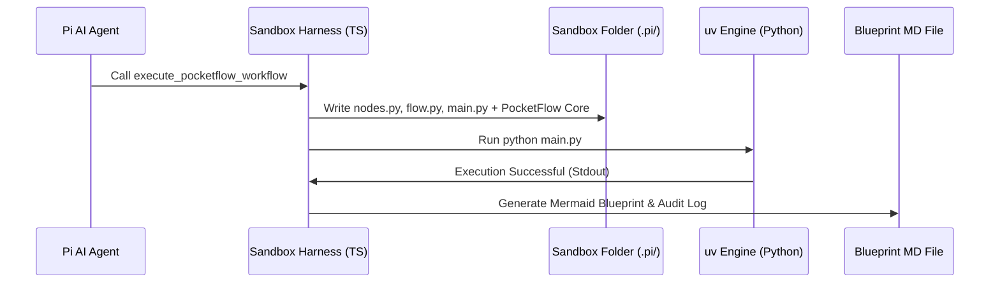
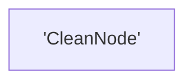

# Chapter 6: Dynamic Sandbox Harness

In [Chapter 5: Human-in-the-Loop (HITL) Loops](05_human_in_the_loop__hitl__loops_.md), we learned how to pause our workflows to ask a human for guidance. But as our AI agent designs more complex nodes and flows, how do we actually run and test them safely on our computer? 

How do we prevent messy dependency conflicts, or avoid cluttering our global Python environment?

Meet the **Dynamic Sandbox Harness**—the ultimate pop-up workshop for your AI workflows.

---

## The Pop-Up Workshop Analogy

Imagine you want to build a wooden birdhouse. 

```
[ Your Living Room ] ---> (Messy sawing & painting) ---> [ Ruined Carpet ] ❌ (Messy!)
```

If you saw wood and spray paint directly on your living room carpet, you will make a massive, permanent mess. 

Instead, imagine a magical **pop-up workshop tent** instantly inflates in your backyard:

```
[ Pop-Up Workshop ] ---> (Safe, isolated building) ---> [ Clean Living Room ] ✅ (Pristine!)
```

This tent comes pre-equipped with every tool you need. You step inside, build your birdhouse, step out, and the tent automatically folds away. It leaves your yard perfectly clean, whilst handing you a beautiful blueprint diagram of the birdhouse you just built.

In `pi-dynamic-workflow`, this pop-up workshop is the **Dynamic Sandbox Harness**. 

---

## What is the Dynamic Sandbox Harness?

The harness is a specialized tool that your Pi AI agent uses behind the scenes. When you ask the agent to run a workflow, the harness:

1. **Isolates**: Creates a temporary folder (`.pi/pocketflow/<task_name>`) just for this run.
2. **Injects**: Automatically drops in a lightweight, local copy of the PocketFlow engine.
3. **Equips**: Installs any extra Python packages you need instantly using a blazing-fast tool called `uv`.
4. **Executes**: Runs your code safely within this sandbox.
5. **Visualizes**: Generates a gorgeous visual Mermaid flowchart showing how your nodes connected!

---

## Our Central Use Case: The Safe Text Cleaner

Let's look at how the AI agent uses the harness to run a workflow called `text_cleaner`. This workflow takes messy text, strips out whitespace, and converts it to uppercase.

Let's look at the three files the agent generates and feeds to our harness.

### Step 1: The Workstation (`nodes.py`)
First, the agent defines our isolated workstation node:

```python
# nodes.py
from pocketflow import Node

class CleanNode(Node):
    def prep(self, shared):
        return shared["raw_text"]
    def exec(self, text):
        return text.strip().upper()
    def post(self, shared, prep, exec_res):
        shared["clean_text"] = exec_res
        return "default"
```
*What's happening here?*  
This is a standard [Chapter 2: The Node (Execution Unit)](02_the_node__execution_unit__.md). It reads from the [Chapter 1: Shared State (Communication Channel)](01_shared_state__communication_channel__.md), cleans the text, and writes it back.

### Step 2: The Assembly Line (`flow.py`)
Next, the agent connects the workstation to an assembly line:

```python
# flow.py
from pocketflow import Flow
from nodes import CleanNode

class CleanFlow(Flow):
    def __init__(self):
        clean = CleanNode()
        super().__init__(start=clean)
```
*What's happening here?*  
This is a standard [Chapter 3: The Flow (Graph Orchestrator)](03_the_flow__graph_orchestrator__.md) that starts with our `CleanNode`.

### Step 3: The Starter Button (`main.py`)
Finally, the agent writes the trigger script:

```python
# main.py
from flow import CleanFlow

shared = {"raw_text": "  hello sandbox!  "}
flow = CleanFlow()
flow.run(shared)
print("Result:", shared["clean_text"])
```
*What's happening here?*  
This script initializes our shared state, instantiates our flow, and executes it.

### Step 4: Running It in the Sandbox
Instead of running this on your actual computer terminal, the Pi agent packs these files up and sends them to the harness tool:

```json
{
  "task_name": "text_cleaner",
  "nodes_code": "...(nodes.py source)...",
  "flow_code": "...(flow.py source)...",
  "main_code": "...(main.py source)...",
  "requirements": []
}
```
*What's happening here?*  
The agent triggers the harness. The harness sets up the pop-up workshop, runs your code, and prints: `Result: HELLO SANDBOX!`.

---

## How It Works Under the Hood

When the agent calls the harness tool, a highly automated sequence of events happens behind the scenes:



1. **The Pi Agent** calls `execute_pocketflow_workflow` with your code.
2. **The Harness** creates a sandbox directory on your computer at `.pi/pocketflow/text_cleaner/`. It writes your code files there, along with a pre-bundled, local copy of the PocketFlow framework.
3. **The `uv` Toolchain** instantly resolves and loads any external Python libraries (like `pydantic` or `instructor`) without touching your global computer settings.
4. **The Sandbox** runs your workflow.
5. **The Harness Introspector** scans your running flow, maps out the node connections, and writes a beautiful markdown file called `text_cleaner_blueprint.md` containing a visual Mermaid diagram!

---

## The Visual Blueprint Output

One of the coolest features of the Dynamic Sandbox Harness is that it automatically generates a visual diagram of your code. 

If you open the generated `text_cleaner_blueprint.md` file in your workspace, you will find this visual flowchart:



It also appends a clean copy of your generated Python code so you have a complete audit trail of what the AI built and executed! This makes debugging incredibly easy.

---

## Conclusion

The **Dynamic Sandbox Harness** is your safety net. It allows your AI agent to be creative, fast, and experimental without risking any damage to your local machine. You get:
* **Zero-Config Isolation**: Your computer stays clean.
* **Blazing Fast Runs**: Powered by the ultra-fast `uv` package tool.
* **Automatic Visualization**: Instant Mermaid blueprints of your generated code.

Now that we can safely execute and visualize our workflows, how do we track their performance, monitor API costs, and debug deep inside our LLM calls?

Head over to **[Chapter 7: Automated Langfuse Tracing](07_automated_langfuse_tracing_.md)** to see how we get production-grade telemetry for our AI systems!

---

Generated by [AI Codebase Knowledge Builder](https://github.com/The-Pocket/Tutorial-Codebase-Knowledge)