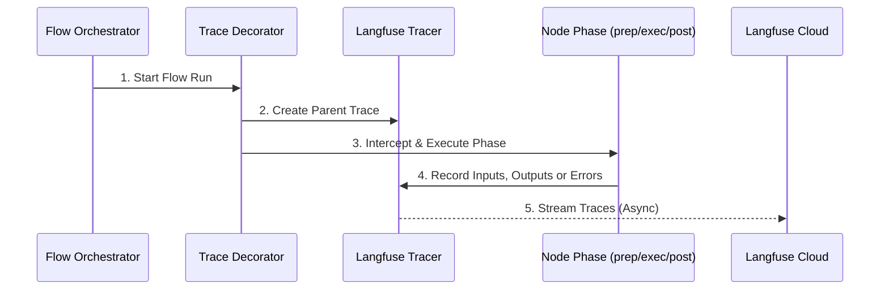

# Chapter 7: Automated Langfuse Tracing

In [Chapter 6: Dynamic Sandbox Harness](06_dynamic_sandbox_harness_.md), we learned how to run and visualize our workflows safely inside an isolated local sandbox. 

But once your AI workflow is running live in production, how do you know what it is actually doing? How do you track down slow steps, monitor LLM API costs, or debug an unexpected error when a user is waiting?

Meet **Automated Langfuse Tracing**—production-grade telemetry for your dynamic workflows.

---

## The Security Camera Analogy

Imagine you manage a large, automated toy factory. 

```
[Raw Materials] ---> [Painter Node] ---> [Packager Node] ---> [Shipped Toy]
                                                                  ❌ (Toy is broken!)
```

If a toy comes out of the assembly line broken, how do you find out which workstation made the mistake? You can't dismantle the whole factory to find out. 

Instead, smart factory owners install a **network of security cameras**:

```
     [ Camera 1 ]              [ Camera 2 ]              [ Camera 3 ]
          │                         │                         │
          ▼                         ▼                         ▼
   [Painter Node]   --->     [Packager Node]   --->     [Shipped Toy]
```

These cameras automatically record:
1. **Who entered the workstation** (`prep` phase inputs).
2. **What work was done and how long it took** (`exec` phase execution).
3. **What left the workstation** (`post` phase outputs).
4. **If any worker tripped and dropped a tool** (Errors and stack traces).

In PocketFlow, this security camera system is **Automated Langfuse Tracing**. It records every action in your workflow and sends it to a beautiful online dashboard where you can audit, debug, and optimize your application in real-time.

---

## Our Central Use Case: The Translator & Polisher Flow

Let's build a workflow that:
1. Translates English text into Spanish.
2. Polishes the Spanish translation to sound natural and poetic.

We want to monitor exactly how long each step takes, inspect what the LLM received and returned, and track our total API spending—all without writing a single manual logging statement!

### Step 1: Setting Up the Security Feed (Credentials)
First, we tell our application where to send its security camera footage. We add our Langfuse credentials to our local `.env` file:

```env
LANGFUSE_PUBLIC_KEY=pk-lf-your-public-key
LANGFUSE_SECRET_KEY=sk-lf-your-secret-key
LANGFUSE_HOST=https://cloud.langfuse.com
```
*What's happening here?*  
These environment variables tell the pre-bundled tracer where your personal Langfuse dashboard is hosted so it can stream data there securely.

### Step 2: Creating a Traced Flow
Next, we write our [Chapter 3: The Flow (Graph Orchestrator)](03_the_flow__graph_orchestrator__.md). To enable tracing, we add a single decorator: `@trace_flow()`.

```python
from pocketflow import Flow
from tracing import trace_flow
from nodes import TranslateNode, PolishNode

@trace_flow() # 🎥 Turn on the security cameras!
class TranslationFlow(Flow):
    def __init__(self):
        t, p = TranslateNode(), PolishNode()
        t >> p
        super().__init__(start=t)
```
*What's happening here?*  
By adding `@trace_flow()` directly above our `TranslationFlow` class, PocketFlow automatically hooks into every [Chapter 2: The Node (Execution Unit)](02_the_node__execution_unit__.md) connected inside. You don't need to manually decorate individual nodes!

### Step 3: Running the Flow
Now, we run our workflow exactly as we did in previous chapters:

```python
flow = TranslationFlow()
shared = {"text": "Good morning, my friend."}

# Run normally. Tracing happens automatically!
flow.run(shared) 
```
*What's happening here?*  
You don't need to change a single line of execution code. As `flow.run()` executes, the decorator intercepts the process and streams the telemetry to your Langfuse dashboard in the background.

---

## Graceful Fail-Safe: The Silent "No-Op" Mode

What happens if you run your code on a computer that doesn't have Langfuse installed, or has no internet connection? 

**Absolutely nothing breaks.** 

If Langfuse credentials are missing, or if the library is not installed, the `@trace_flow()` decorator gracefully degrades to a **silent, zero-overhead "no-op" (no-operation) mode**. It acts as if the decorator isn't even there, ensuring your code runs flawlessly in local test environments without ever throwing import errors or crashing.

---

## How It Works Under the Hood

When you execute a traced flow, the orchestrator and the decorator coordinate to capture telemetry at every step:



1. **The Flow Orchestrator** starts the workflow run.
2. **The Trace Decorator** intercepts the start, creating a master "Parent Trace" in Langfuse.
3. As each node runs, the decorator intercepts the `prep`, `exec`, and `post` phases.
4. **The Tracer** measures execution timings and captures the inputs, outputs, or any exceptions thrown.
5. Telemetry is streamed **asynchronously** to Langfuse Cloud, ensuring your user-facing application remains fast and lag-free.

---

## Deep Dive: How Nodes are Patched

How does the decorator inspect your nodes without you writing any logging code? 

Under the hood, the decorator automatically scans your flow's node graph and wraps your `prep`, `exec`, and `post` methods with a tracing wrapper. 

Here is a simplified look at the wrapping logic inside `tracing/decorator.py`:

```python
# Inside tracing/decorator.py (Simplified)
def traced_method(*args, **kwargs):
    span_id = tracer.start_node_span(node_name, node_id, phase)
    try:
        res = original_method(*args, **kwargs)
        # Record successful output
        tracer.end_node_span(span_id, output_data=res)
        return res
    except Exception as e:
        # Record crash details
        tracer.end_node_span(span_id, error=e)
        raise
```
*What's happening here?*  
Before your node method runs, the tracer starts a "span" (a recording session). It executes your original method. If it succeeds, it records the output. If it crashes, it logs the exact error details and stack trace before letting the program raise the exception.

---

## Dual-Level Telemetry (Workflow vs. LLM Level)

With PocketFlow, you get two layers of observability side-by-side:

### Level A: Workflow & Graph Level
Captured automatically by `@trace_flow()`. This tracks your custom Python logic, showing you how data flows from [Chapter 1: Shared State (Communication Channel)](01_shared_state__communication_channel__.md) into your nodes, and how long each node phase takes to execute.

### Level B: Model & LLM Level
When you use structured clients like `Instructor` from [Chapter 4: Structured Nodes (Schema Enforcement)](04_structured_nodes__schema_enforcement__.md), the underlying OpenAI or Anthropic clients automatically instrument themselves. 

They submit detailed model-level logs to Langfuse, showing:
* The exact system instructions and user prompts.
* The raw JSON returned by the model.
* The exact token count and calculated API costs!

---

## Conclusion

By using **Automated Langfuse Tracing**, you turn your black-box AI workflows into transparent, highly observable systems. You get:
* **One-Line Integration**: Just add `@trace_flow()` to your Flow class.
* **Deep Visibility**: Track every `prep`, `exec`, and `post` phase automatically.
* **Resilient Architecture**: Zero-overhead "no-op" mode if Langfuse is offline.
* **Cost & Performance Tracking**: Easily spot slow steps and expensive LLM calls.

---

## 🎉 Congratulations!

You have completed the entire **PocketFlow** tutorial series! 

Let's review the powerful toolkit you have built:
1. **[Shared State](01_shared_state__communication_channel__.md)**: The clean communication channel for your steps.
2. **[The Node](02_the_node__execution_unit__.md)**: Modular, isolated, and self-healing execution units.
3. **[The Flow](03_the_flow__graph_orchestrator__.md)**: The assembly line supervisor directing traffic.
4. **[Structured Nodes](04_structured_nodes__schema_enforcement__.md)**: Enforcing strict Pydantic schemas on unpredictable LLMs.
5. **[Human-in-the-Loop Loops](05_human_in_the_loop__hitl__loops_.md)**: Pausing automated runs for human quality control.
6. **[Dynamic Sandbox Harness](06_dynamic_sandbox_harness_.md)**: Safely testing and visualizing your agent's code.
7. **[Automated Tracing](07_automated_langfuse_tracing_.md)**: Production-grade monitoring and debugging.

You are now fully equipped to design, build, test, and run production-grade, self-healing, dynamic AI workflows. Happy building!

---

Generated by [AI Codebase Knowledge Builder](https://github.com/The-Pocket/Tutorial-Codebase-Knowledge)