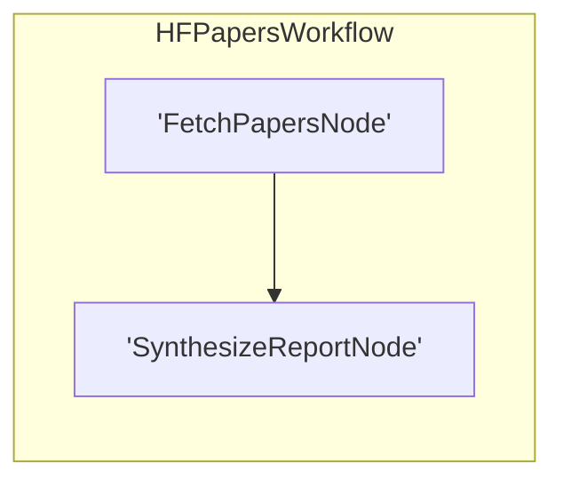

# Workflow Blueprint: hf_agentic_harnesses

Generated automatically via PocketFlow recursive visualization engine.

## 🎯 Original Prompt / Architectural Intent

> lets do another one that use hf papers to list the 10 latest papers about agentic harnesses

## 🧠 Architectural Thinking Process & Design Choices

I will design a highly professional research workflow that fetches 10 papers using `hf papers search` on 'agentic harness'.
Then, an LLM synthesis node analyzes the meta-data and summaries to write a highly detailed, chronological, themed markdown report saved locally as 'agentic_harness_report.md' in the work directory.
- Flow topology: FetchPapersNode >> SynthesizeReportNode.
- Utilizing class-based Flow and correct standard parameter 'start'.
- Updating the shared state in-place and returning transition string action 'default'.
- Storing final results in current directory.

## Topology Diagram



## 📄 Workspace Source Code Auditing

### `nodes.py`

```python
import subprocess
import json
import os
from pocketflow import Node
from utils.call_llm import call_llm

class FetchPapersNode(Node):
    """Natively queries the Hugging Face CLI to search for academic papers."""
    def prep(self, shared):
        return {
            "query": shared.get("search_query", "agentic harness"),
            "limit": shared.get("limit_papers", 10)
        }

    def exec(self, prep_res):
        query = prep_res["query"]
        limit = prep_res["limit"]
        
        # Execute the hf papers search CLI and return JSON output
        cmd = ["hf", "papers", "search", query, "--limit", str(limit), "--format", "json"]
        res = subprocess.run(cmd, capture_output=True, text=True, check=True)
        data = json.loads(res.stdout)
        
        papers = []
        for p in data:
            papers.append({
                "id": p.get("id"),
                "title": p.get("title", ""),
                "summary": p.get("summary", ""),
                "authors": [a.get("name", "") for a in p.get("authors", [])],
                "published_at": p.get("published_at", ""),
                "upvotes": p.get("upvotes", 0)
            })
        return papers

    def post(self, shared, prep_res, exec_res):
        # Update shared state in-place and return string transition
        shared["papers"] = exec_res
        return "default"


class SynthesizeReportNode(Node):
    """Synthesizes all metadata/summaries into a systematic markdown report saved inside os.getcwd()."""
    def prep(self, shared):
        return {
            "papers": shared.get("papers", []),
            "query": shared.get("search_query", "")
        }

    def exec(self, prep_res):
        papers = prep_res["papers"]
        query = prep_res["query"]
        
        # Formulate papers text dump for the model
        papers_text = []
        for idx, p in enumerate(papers, 1):
            authors_str = ", ".join(p['authors'])
            papers_text.append(
                f"{idx}. [{p['id']}] '{p['title']}'\n"
                f"   Authors: {authors_str}\n"
                f"   Published: {p['published_at']}\n"
                f"   Upvotes: {p['upvotes']}\n"
                f"   Summary: {p['summary']}\n"
            )
        papers_dump = "\n\n".join(papers_text)
        
        prompt = (
            f"You are an AI research scientist compiling literature. Analyze these 10 academic papers matching query '{query}':\n\n"
            f"{papers_dump}\n\n"
            "Based on this data, construct a structured academic synthesis report in markdown format. It must include:\n"
            "1. # Research Report: State of Agentic Harnesses and Orchestration Loops\n"
            "2. ## Executive Summary\n"
            "   A 2-paragraph synthesis of how the role of harnesses is shifting in 2025/2026 (focus on automatic evolution (AHE), safety, security/backdoors, memory, game evaluation, and spatial-cognitive map priors).\n"
            "3. ## Core Emerging Themes\n"
            "   Discuss 3 distinct trends observed across these 10 papers.\n"
            "4. ## Annotated Bibliography of 10 Pioneer Papers\n"
            "   List all 10 papers chronologically. For each, write the Title, Authors, URL (https://arxiv.org/abs/<id>), and a concise 2-sentence summary illustrating its core harness architecture contribution.\n\n"
            "Output only the completed Markdown. Do not include introductory/outro conversational fluff or enclosing markdown triple backticks."
        )
        
        report_content = call_llm(prompt)
        
        # Write report to user's current directory as an active workspace output artifact
        output_path = os.path.join(os.getcwd(), "agentic_harness_report.md")
        with open(output_path, "w", encoding="utf-8") as f:
            f.write(report_content)
            
        return output_path

    def post(self, shared, prep_res, exec_res):
        shared["report_path"] = exec_res
        with open(exec_res, "r", encoding="utf-8") as f:
            shared["report_content"] = f.read()
        return "default"
```

### `flow.py`

```python
from pocketflow import Flow
from nodes import FetchPapersNode, SynthesizeReportNode

# Subclass Flow directly to enable native visualization and tracing configurations
class HFPapersWorkflow(Flow):
    def __init__(self):
        fetch = FetchPapersNode()
        synthesis = SynthesizeReportNode()
        
        # Chain the nodes sequentially
        fetch >> synthesis
        
        # Instantiate Flow with the start node using parameter 'start'
        super().__init__(start=fetch)
```

### `main.py`

```python
# /// script
# requires-python = ">=3.12"
# dependencies = [
#     "langfuse>=2.0.0,<3.0.0",
#     "python-dotenv>=1.0.0",
#     "pydantic>=2.0.0",
# ]
# ///

from flow import HFPapersWorkflow

def run():
    print("🚀 Initializing HF Papers Research Workflow for 'agentic harness'...")
    
    # Initialize the shared state
    shared = {
        "search_query": "agentic harness",
        "limit_papers": 10
    }
    
    # Run the workflow
    flow = HFPapersWorkflow()
    flow.run(shared)
    
    print("\n=== WORKFLOW SUCCESS ===")
    print(f"Report written locally to: {shared.get('report_path')}")
    print("\n--- Synthesis Report Preview (Top section) ---")
    
    # Preview top portion of our report
    content = shared.get("report_content", "")
    print(content[:1000] + "\n\n... [Remaining content saved in file] ...")

if __name__ == "__main__":
    run()
```
