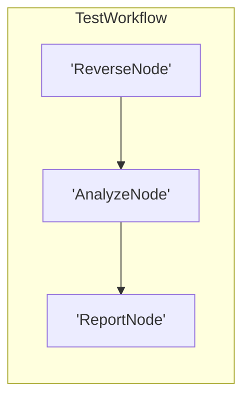

# Workflow Blueprint: pocketflow_self_test

Generated automatically via PocketFlow recursive visualization engine.

## 🎯 Original Prompt / Architectural Intent

> lets create a new simple workflow just for testing

## 🧠 Architectural Thinking Process & Design Choices

I will design a simple multi-step workflow with three nodes to test the pocketflow-harness.
- Node 1: ReverseNode (Computational) - reverses the user string.
- Node 2: AnalyzeNode (Computational) - counts vowels and consonants.
- Node 3: ReportNode (LLM/Agentic) - uses call_llm to synthesize a funny summary/haiku of the input and analysis.
We will subclass Flow directly, use start=reverse, and make sure Node post methods return action strings and modify shared states in-place.
Requirements list will include standard python-dotenv, pydantic, and langfuse libraries.

## Topology Diagram



## 📄 Workspace Source Code Auditing

### `nodes.py`

```python
from pocketflow import Node
from utils.call_llm import call_llm

class ReverseNode(Node):
    def prep(self, shared):
        return shared.get("input_text", "")

    def exec(self, text):
        return text[::-1]

    def post(self, shared, prep_res, exec_res):
        # Update shared state in-place and return action string
        shared["reversed_text"] = exec_res
        return "default"

class AnalyzeNode(Node):
    def prep(self, shared):
        return shared.get("input_text", "")

    def exec(self, text):
        vowels = sum(1 for char in text if char.lower() in "aeiou")
        consonants = sum(1 for char in text if char.isalpha() and char.lower() not in "aeiou")
        return {"vowels": vowels, "consonants": consonants}

    def post(self, shared, prep_res, exec_res):
        # Update shared state in-place and return action string
        shared["analysis"] = exec_res
        return "default"

class ReportNode(Node):
    def prep(self, shared):
        return {
            "original": shared.get("input_text"),
            "reversed": shared.get("reversed_text"),
            "analysis": shared.get("analysis")
        }

    def exec(self, data):
        prompt = (
            f"Original text: '{data['original']}'\n"
            f"Reversed text: '{data['reversed']}'\n"
            f"Analysis: {data['analysis']}\n"
            "Generate a funny short summary/haiku about this text reversing transformation."
        )
        return call_llm(prompt)

    def post(self, shared, prep_res, exec_res):
        # Update shared state in-place and return action string
        shared["report"] = exec_res
        return "default"
```

### `flow.py`

```python
from pocketflow import Flow
from nodes import ReverseNode, AnalyzeNode, ReportNode

# Subclass Flow directly to ensure correct visualization and tracing
class TestWorkflow(Flow):
    def __init__(self):
        reverse = ReverseNode()
        analyze = AnalyzeNode()
        report = ReportNode()
        
        # Connect nodes sequentially using the '>>' operator
        reverse >> analyze >> report
        
        # Initialize parent class using 'start' parameter (do NOT use start_node)
        super().__init__(start=reverse)
```

### `main.py`

```python
# /// script
# requires-python = ">=3.12"
# dependencies = [
#     "langfuse>=2.0.0,<3.0.0",
#     "python-dotenv>=1.0.0",
#     "pydantic>=2.0.0",
# ]
# ///

from flow import TestWorkflow

def run():
    # Define initial shared state
    shared = {
        "input_text": "PocketFlow is an amazing agentic workflow framework!"
    }
    
    # Initialize our custom Flow class
    flow = TestWorkflow()
    
    # Execute the flow
    print("Executing PocketFlow self-test workflow...")
    flow.run(shared)
    
    # Print final results stored in shared state
    print("\n=== WORKFLOW SUCCESS ===")
    print(f"Original: {shared.get('input_text')}")
    print(f"Reversed: {shared.get('reversed_text')}")
    print(f"Analysis: {shared.get('analysis')}")
    print("\nGenerated Report:")
    print(shared.get('report'))

if __name__ == "__main__":
    run()
```
