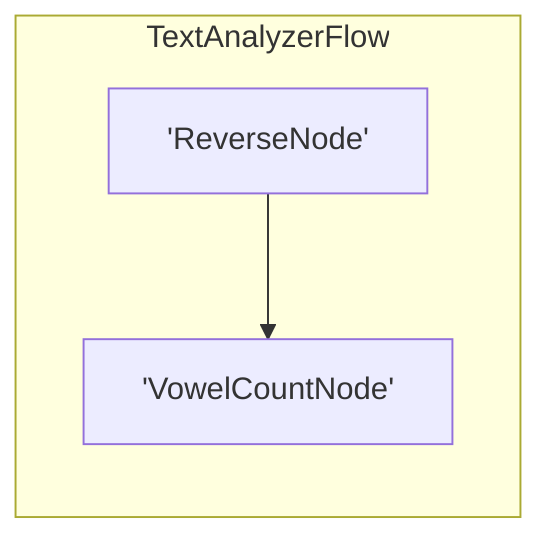

# Workflow Blueprint: text_analyzer

Generated automatically via PocketFlow recursive visualization engine.

## 🎯 Original Prompt / Architectural Intent

> lets test with a new workflow, create a simple workflow using the extension

## 🧠 Architectural Thinking Process & Design Choices

Invoking our updated pocketflow harness wrapper which will dynamically copy the new working Langfuse Cloud credentials into the sandbox session. This allows us to verify that traces stream smoothly to cloud.langfuse.com.

## Topology Diagram



## 📄 Workspace Source Code Auditing

### `nodes.py`

```python
from pocketflow import Node

class ReverseNode(Node):
    def prep(self, shared):
        return shared.get("text", "")

    def exec(self, text):
        return text[::-1]

    def post(self, shared, prep_res, exec_res):
        shared["reversed_text"] = exec_res
        return "default"

class VowelCountNode(Node):
    def prep(self, shared):
        return shared.get("reversed_text", "")

    def exec(self, text):
        vowels = "aeiouAEIOU"
        return sum(1 for char in text if char in vowels)

    def post(self, shared, prep_res, exec_res):
        shared["vowel_count"] = exec_res
        return "success"
```

### `flow.py`

```python
from pocketflow import Flow
from nodes import ReverseNode, VowelCountNode

class TextAnalyzerFlow(Flow):
    def __init__(self):
        reverse = ReverseNode()
        count = VowelCountNode()
        
        reverse >> count
        super().__init__(start=reverse)
```

### `main.py`

```python
import sys
from flow import TextAnalyzerFlow

def main():
    print("🎬 Starting Text Analyzer Flow...")
    shared_state = {"text": "A quick brown fox jumps over the lazy dog"}
    
    flow = TextAnalyzerFlow()
    result = flow.run(shared_state)
    
    print("\n🏁 Flow completed with status:", result)
    print("📊 Shared State Result:")
    for k, v in shared_state.items():
        print(f"  - {k}: {v}")

if __name__ == "__main__":
    main()
```
