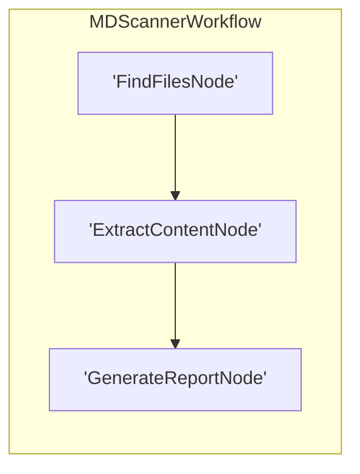

# Workflow Blueprint: workspace_md_scanner

Generated automatically via PocketFlow recursive visualization engine.

## 📝 Workflow Objective & Description

Crawl recursively through the workspace to discover all markdown files, extract their top 10 lines of preview content, and generate a synthesized markdown audit report under ./workspace_md_summary.md.

## 🎯 Original Prompt / Architectural Intent

> Lets create a new workflow to test the extension. Create a workflow to open every md file in this folder and subfolders and copy the first 10 lines of the file. Create a repot at the end with the names , locations and content of every md file in the repo

## 🧠 Architectural Thinking Process & Design Choices

I am updating the paths in nodes.py to resolve the parent workspace of .pi / .git dynamically because subprocess runs from inside the taskDir.
By mapping workspace root correctly:
1. Files will be found in the actual project directory.
2. workspace_md_summary.md will be written to the developer's root folder where they can open it immediately.
Connections and metadata structures are otherwise preserved and clean.

## Topology Diagram



## 📄 Workspace Source Code Auditing

### `nodes.py`

```python
import os
from pocketflow import Node

def get_workspace_root():
    # Dynamically find parent workspace containing .pi / .git folder
    current = os.path.dirname(os.path.abspath(__file__))
    while current:
        if os.path.exists(os.path.join(current, ".pi")) or os.path.exists(os.path.join(current, ".git")):
            return current
        parent = os.path.dirname(current)
        if parent == current:
            break
        current = parent
    return os.getcwd()  # Fallback

class FindFilesNode(Node):
    """Finds all non-ignored .md files in the parent workspace recursively."""
    def prep(self, shared):
        root = get_workspace_root()
        shared["workspace_root"] = root
        return root

    def exec(self, base_dir):
        md_files = []
        # Walk recursively skipping hidden and standard build/virtualenv dirs
        ignore_dirs = {".venv", ".pi", ".git", "node_modules", "assets", "__pycache__", "instructor"}
        for root, dirs, files in os.walk(base_dir):
            # Prune directories in place to prevent scanning
            dirs[:] = [d for d in dirs if d not in ignore_dirs and not d.startswith(".")]
            
            for file in files:
                if file.endswith(".md"):
                    full_path = os.path.join(root, file)
                    rel_path = os.path.relpath(full_path, base_dir)
                    md_files.append(rel_path)
        return sorted(md_files)

    def post(self, shared, prep_res, exec_res):
        shared["files"] = exec_res
        return "default"


class ExtractContentNode(Node):
    """Opens discovered files and extracts up to the first 10 lines of preview."""
    def prep(self, shared):
        return {
            "files": shared.get("files", []),
            "root": shared.get("workspace_root", "")
        }

    def exec(self, prep_res):
        files = prep_res["files"]
        root = prep_res["root"]
        results = []
        for file_path in files:
            full_path = os.path.join(root, file_path)
            try:
                with open(full_path, "r", encoding="utf-8", errors="ignore") as f:
                    lines = [f.readline() for _ in range(10)]
                    lines = [line for line in lines if line]
                    head_content = "".join(lines)
                results.append({
                    "rel_path": file_path,
                    "filename": os.path.basename(file_path),
                    "head": head_content
                })
            except Exception as e:
                print(f"Error reading file {file_path}: {e}")
        return results

    def post(self, shared, prep_res, exec_res):
        shared["extracted_contents"] = exec_res
        return "default"


class GenerateReportNode(Node):
    """Writes a local workspace_md_summary.md file summarising current elements in workspace root."""
    def prep(self, shared):
        return {
            "contents": shared.get("extracted_contents", []),
            "root": shared.get("workspace_root", "")
        }

    def exec(self, prep_res):
        contents = prep_res["contents"]
        root = prep_res["root"]
        
        lines = [
            "# Workspace Markdown Analysis Report",
            "",
            "Generated automatically by the Markdown Scanner PocketFlow workflow.",
            f"**Total markdown files analyzed:** {len(contents)}",
            "",
            "---",
            ""
        ]
        
        for idx, item in enumerate(contents, 1):
            lines.append(f"## {idx}. `{item['filename']}`")
            lines.append(f"**Location:** `{item['rel_path']}`")
            lines.append("")
            lines.append("### First 10 Lines Preview:")
            lines.append("```markdown")
            sanitized_head = item['head'].replace("```", "''")
            lines.append(sanitized_head.strip())
            lines.append("```")
            lines.append("")
            lines.append("---")
            lines.append("")
            
        report_content = "\n".join(lines)
        report_path = os.path.join(root, "workspace_md_summary.md")
        with open(report_path, "w", encoding="utf-8") as f:
            f.write(report_content)
        return report_path

    def post(self, shared, prep_res, exec_res):
        shared["report_path"] = exec_res
        with open(exec_res, "r", encoding="utf-8") as f:
            shared["report_content"] = f.read()
        return "default"
```

### `flow.py`

```python
from pocketflow import Flow
from nodes import FindFilesNode, ExtractContentNode, GenerateReportNode

# Subclass Flow directly to verify auto-tracing and graph rendering
class MDScannerWorkflow(Flow):
    def __init__(self):
        find_node = FindFilesNode()
        extract_node = ExtractContentNode()
        report_node = GenerateReportNode()
        
        # Connect nodes sequentially
        find_node >> extract_node >> report_node
        
        # Define start node using standard 'start' parameter
        super().__init__(start=find_node)
```

### `main.py`

```python
# /// script
# requires-python = ">=3.12"
# dependencies = [
#     "langfuse>=2.0.0,<3.0.0",
#     "python-dotenv>=1.0.0",
#     "pydantic>=2.0.0",
#     "instructor>=1.0.0",
# ]
# ///

from flow import MDScannerWorkflow

def run():
    print("🚀 Running Workspace MD Scanner Workflow...")
    shared = {}
    
    flow = MDScannerWorkflow()
    flow.run(shared)
    
    print("\n=== SCANNER RUN COMPLETE ===")
    print(f"Report saved locally to: {shared.get('report_path')}")
    print(f"Total files scanned: {len(shared.get('extracted_contents', []))}")

if __name__ == "__main__":
    run()
```
